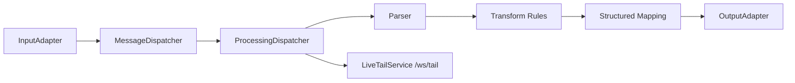

# Logparser

Logparser는 Spring Boot 기반 로그 수집, 파싱, 변환, 출력 파이프라인입니다. 입력 어댑터가 원문 이벤트를 `LogEvent`로 만들고, dispatcher가 message type 기준으로 parser, transform, structured mapping, output 단계를 연결합니다.

설정은 REST API와 정적 관리 UI에서 관리하며, 기본 설정 저장소는 SQLite와 Flyway migration입니다.

## 현재 구현 요약

- 입력: File, TCP, TCP/TLS, UDP, HTTP, HTTPS, Kafka, SNMP, RabbitMQ, RabbitMQ/TLS, Castrelyx TCP mTLS gzip, Fake
- 출력: Console, TCP, HTTP, Kafka, OpenSearch, RabbitMQ, MariaDB, ClickHouse, Benchmark
- parser: JSON, Grok, Regex, RFC3164 Syslog, RFC5424 Syslog, HTTP
- transform: Filter, AddProperty, RemoveProperty
- Live Tail: `/ws/tail` WebSocket과 `/api/v1/pipeline/livetail/*` API로 처리 중 이벤트를 브로드캐스트
- 설정 메타데이터: `/api/v1/metadata/*`
- 문서 자산: `README.md`, `AGENTS.md`, `readme/`, `docs/` 아래 파일을 `/api/v1/docs/*`에서 제공

## 기술 스택

- Java 21
- Spring Boot 3
- Gradle
- SQLite JDBC, Flyway, Spring Data JPA
- Kafka, RabbitMQ Java client, SNMP4J
- MariaDB JDBC driver
- Java HTTP client, OpenSearch HTTP client
- JUnit 5

## 프로젝트 구조

```text
src/main/java/org/keinus/logparser/
  application/pipeline/          # 런타임 파이프라인 구동
  application/service/           # Live Tail, 문서, thread monitoring 등 애플리케이션 서비스
  domain/configuration/          # 설정 모델, 메타데이터, 검증, seed
  domain/input/                  # 입력 어댑터
  domain/output/                 # 출력 어댑터
  domain/parse/                  # parser 모델과 서비스
  domain/transformation/         # transform, structured mapping
  infrastructure/persistence/    # SQLite entity/repository, migration 보조
  interfaces/controller/         # REST API
  interfaces/websocket/          # Live Tail WebSocket

src/main/resources/
  static/                        # 관리 UI 정적 파일
  db/migration/                  # Flyway migration

src/test/                        # JUnit 테스트
readme/                          # 상세 사용자 문서와 다이어그램 샘플
```

## 빠른 시작

Java 21이 필요합니다.

```powershell
.\gradlew bootRun
```

기본 포트는 `8765`입니다.

- 관리 UI: `http://localhost:8765`
- API base URL: `http://localhost:8765/api/v1`
- Swagger UI: `http://localhost:8765/swagger-ui.html`

테스트와 빌드는 다음 명령으로 실행합니다.

```powershell
.\gradlew test
.\gradlew build
```

Gradle이 Java를 찾지 못하면 Java 21 설치 경로를 `JAVA_HOME`에 지정합니다.

```powershell
$env:JAVA_HOME='C:\Path\To\Java21'
.\gradlew test
```

## Docker 실행

```powershell
docker build -t logparser .
docker run -p 8765:8765 logparser
```

Compose를 사용할 수도 있습니다.

```powershell
docker compose up --build
```

## 파이프라인 개요



`messagetype`은 입력, parser, transform, output을 연결하는 주요 키입니다. 출력 어댑터의 `messagetype`을 비워 두면 `OutputFactory`가 `all`로 정규화하고, 모든 message type을 받을 수 있습니다.

## 입력 어댑터

| Type | Alias | 필수 설정 | 설명 |
| --- | --- | --- | --- |
| `FileInputAdapter` | `file` | `path` | 파일 tail 방식으로 라인 단위 로그를 읽습니다. |
| `TcpInputAdapter` | `tcp` | `port` | newline-delimited TCP 로그를 수신합니다. |
| `TlsTcpInputAdapter` | `tls_tcp`, `tlstcp` | `port`, `configParams` | `TcpInputAdapter`와 같은 라인 프로토콜을 TLS 서버 소켓으로 수신합니다. |
| `UdpInputAdapter` | `udp` | `port` | UDP datagram 로그를 수신합니다. |
| `HttpInputAdapter` | `http` | `port` | HTTP 요청 전체를 원문 이벤트로 받습니다. |
| `HttpsInputAdapter` | `https` | `port`, `configParams` | `HttpInputAdapter`와 같은 HTTP 수신을 TLS 서버 소켓으로 처리합니다. |
| `KafkaInputAdapter` | `kafka` | `bootstrapservers`, `topicid` | Kafka topic을 consume합니다. |
| `SnmpInputAdapter` | `snmp` | `configParams` | SNMP v1/v2c/v3 target과 OID를 주기적으로 polling합니다. |
| `RabbitMqInputAdapter` | `rabbitmq` | `configParams.queue` | RabbitMQ queue를 `basicGet` 방식으로 polling합니다. `tlsEnabled=true`면 TLS 연결을 사용합니다. |
| `TlsRabbitMqInputAdapter` | `tls_rabbitmq`, `tlsrabbitmq` | `configParams.queue` | RabbitMQ TLS 입력입니다. 포트 생략 시 `5671`을 사용합니다. |
| `TcpMtlsGzipInputAdapter` | `tcp_mtls_gzip` | `port`, `configParams` | Castrelyx agent gzip batch를 TCP/mTLS로 수신합니다. |
| `FakeInputAdapter` | `fake` | 없음 | 테스트 이벤트를 생성합니다. |

### 서버 TLS 입력

`TlsTcpInputAdapter`와 `HttpsInputAdapter`는 `configParams`에 서버 인증서 key store를 요구합니다. `clientAuth`가 `want` 또는 `need`이면 trust store도 필요합니다.

```json
{
  "keyStorePath": "/app/certs/logparser-server.p12",
  "keyStorePasswordEnv": "LOGPARSER_KEYSTORE_PASSWORD",
  "keyStoreType": "PKCS12",
  "keyPasswordEnv": "LOGPARSER_KEY_PASSWORD",
  "clientAuth": "need",
  "trustStorePath": "/app/certs/client-ca.p12",
  "trustStorePasswordEnv": "LOGPARSER_TRUSTSTORE_PASSWORD",
  "trustStoreType": "PKCS12",
  "enabledProtocols": ["TLSv1.3", "TLSv1.2"]
}
```

지원 필드는 `keyStorePath`, `keyStorePassword` 또는 `keyStorePasswordEnv`, `keyStoreType`, `keyPassword` 또는 `keyPasswordEnv`, `trustStorePath`, `trustStorePassword` 또는 `trustStorePasswordEnv`, `trustStoreType`, `tlsAlgorithm`, `enabledProtocols`, `clientAuth`, `needClientAuth`, `wantClientAuth`입니다.

### RabbitMQ 입력

`RabbitMqInputAdapter`는 `configParams.queue`가 필수입니다. host와 port는 DTO 필드 또는 `configParams` 둘 다에서 받을 수 있으며, DTO 값이 우선합니다.

```json
{
  "queue": "logs.input",
  "username": "guest",
  "password": "guest",
  "virtualHost": "/",
  "autoAck": false,
  "prefetchCount": 10,
  "declareQueue": false
}
```

TLS 연결을 쓰려면 기존 RabbitMQ 입력에 `tlsEnabled=true`를 주거나, `TlsRabbitMqInputAdapter`를 사용합니다.

```json
{
  "queue": "logs.input",
  "username": "guest",
  "password": "guest",
  "virtualHost": "/",
  "tlsEnabled": true,
  "hostnameVerification": true,
  "trustStorePath": "/app/certs/rabbitmq-truststore.p12",
  "trustStorePasswordEnv": "RABBITMQ_TRUSTSTORE_PASSWORD"
}
```

### Castrelyx TCP mTLS gzip 입력

`TcpMtlsGzipInputAdapter`는 Castrelyx agent batch 전용 입력입니다. 서버는 client certificate을 필수로 요구하고, 인증서 CN이 batch의 `source_id`와 일치해야 합니다.

```json
{
  "keyStorePath": "/var/lib/castrelsign/certs/server.p12",
  "keyStorePasswordEnv": "CASTRELSIGN_KEYSTORE_PASSWORD",
  "trustStorePath": "/var/lib/castrelsign/certs/truststore.p12",
  "trustStorePasswordEnv": "CASTRELSIGN_TRUSTSTORE_PASSWORD",
  "maxFrameBytes": 10485760,
  "maxConnections": 32,
  "tlsReloadIntervalMs": 5000,
  "ackMode": "queueAccepted"
}
```

batch payload는 4-byte big-endian frame length 뒤에 gzip JSON body가 오는 형식입니다. 기본 상한은 compressed frame 10 MiB, decompressed JSON 16 MiB, batch item 5,000개입니다. JSON body는 `source_id`, `tenant_id`, `items[]`를 포함하고, 각 item은 `kind`, `type`, `key`, `payload`를 가질 수 있습니다. adapter는 payload의 object field를 `payload_<field>` 형태로 추가 노출합니다.

schema `1.1` batch는 다음을 추가 검증합니다.

- nonblank, 최대 128자인 `batch_id`
- `chunk_count > 0`이고 `0 <= chunk_index < chunk_count`인 정수 chunk metadata
- 배열 형태의 `items`
- item별 nonblank, 최대 256자인 `item_id`
- 같은 chunk 안에서 중복되지 않는 0 이상의 정수 `sequence`

각 `LogEvent`에는 `batch_id`, `chunk_index`, `chunk_count`, 실제 `items[]` 길이인 `chunk_item_count`, `item_id`, `item_sequence`가 추가됩니다. adapter는 전체 chunk가 queue의 남은 용량에 들어가는지 먼저 확인하고 모든 item을 enqueue한 뒤 ACK합니다. 용량이 부족하면 아무 item도 넣지 않고 `queue_full` NACK를 반환합니다.

최근 50,000개의 `source_id:batch_id:chunk_index`는 고정 길이 SHA-256 digest로 process memory에 기억합니다. 같은 process 수명 안의 최근 재전송이면 다시 enqueue하지 않고 ACK하지만, restart와 cache eviction을 넘는 영구 dedup store는 아닙니다. ACK는 메모리 input queue 수락을 의미하며 downstream output이나 ClickHouse commit을 의미하지 않습니다.

동시 client 수는 `maxConnections` semaphore로 제한합니다. 생략하면 input의 `workerThreads`, 둘 다 없으면 32를 사용합니다. Adapter는 `tlsReloadIntervalMs`마다 key/trust PKCS12 내용 digest를 확인합니다. 파일이 원자 교체되면 새 SSLContext를 먼저 검증한 뒤 같은 port의 listener를 재바인드하며, 새 material이 깨졌으면 기존 listener를 유지합니다. 이미 연결된 client session은 종료될 때까지 기존 context를 사용합니다.

### SNMP 입력

SNMP 설정은 `configParams.targets[]`와 `configParams.oids[]`가 필수입니다.

```json
{
  "intervalMs": 60000,
  "retries": 1,
  "targets": [
    {
      "name": "sw-core-01",
      "host": "192.0.2.10",
      "port": 161,
      "community": "public",
      "version": "2c"
    }
  ],
  "oids": [
    {
      "name": "sysName",
      "oid": "1.3.6.1.2.1.1.5.0"
    }
  ]
}
```

SNMPv3는 `securityName`과 security level별 passphrase를 요구합니다. passphrase는 `authPassphraseEnv`, `privPassphraseEnv` 사용을 권장합니다.

## Parser와 Transform

| Type | 필수 설정 | 설명 |
| --- | --- | --- |
| `JsonParser` | 없음 | JSON 원문을 field map으로 파싱합니다. |
| `GrokParser` | `param` | Grok pattern을 적용합니다. |
| `RegexParser` | `param` | 정규식 capture group을 적용합니다. |
| `RFC3164SyslogParser` | 없음 | RFC3164 syslog를 파싱합니다. |
| `RFC5424SyslogParser` | 없음 | RFC5424 syslog를 파싱합니다. |
| `HttpParser` | 없음 | HTTP access log 형식을 파싱합니다. |

| Type | 필수 설정 | 설명 |
| --- | --- | --- |
| `Filter` | `filterPass` 또는 `filterDrop` | 조건에 맞는 이벤트를 통과 또는 제거합니다. |
| `AddProperty` | `addProperties` | 이벤트에 필드를 추가합니다. |
| `RemoveProperty` | `removeProperties` | 이벤트에서 필드를 제거합니다. |

## 출력 어댑터

| Type | Alias | 필수 설정 | 설명 |
| --- | --- | --- | --- |
| `ConsoleOutputAdapter` | `console` | 없음 | 서버 로그/콘솔로 출력합니다. |
| `TcpOutputAdapter` | `tcp` | `host`, `port` | TCP로 이벤트를 전송합니다. |
| `HttpOutputAdapter` | `http` | `url` | HTTP `POST`, `PUT`, `PATCH`로 이벤트를 전송합니다. |
| `KafkaOutputAdapter` | `kafka` | `bootstrapservers`, `topicid` | Kafka topic으로 produce합니다. |
| `OpenSearchOutputAdapter` | `opensearch` | `url`, `index` | OpenSearch/Elasticsearch index에 전송합니다. |
| `RabbitMQAdapter` | `rabbitmq` | `host`, `exchange`, `routingkey` | RabbitMQ exchange로 publish합니다. |
| `MariaDbOutputAdapter` | `mariadb` | `configParams.jdbcUrl`, `usernameEnv`, `passwordEnv` | Castrelyx event row를 MariaDB에 batch insert합니다. |
| `ClickHouseOutputAdapter` | `clickhouse` | `configParams.endpointUrl`, `tableName` | ClickHouse HTTP API로 JSONEachRow batch insert합니다. |
| `BenchmarkAdapter` | `benchmark` | 없음 | 성능 측정용 출력입니다. |

### MariaDB 출력

`MariaDbOutputAdapter`는 `event_json` JSON 컬럼에 `LogEvent.toOutputJson()` 결과를 저장하고, 조회에 자주 쓰는 `agent_id`, `tenant_id`, `source_id`, `item_kind`, `item_type`, `item_key`를 별도 컬럼으로 저장합니다.

```json
{
  "jdbcUrl": "jdbc:mariadb://mariadb:3306/castrelyx",
  "usernameEnv": "CASTRELYX_DB_USER",
  "passwordEnv": "CASTRELYX_DB_PASSWORD",
  "tableName": "castrelyx_agent_events",
  "batchSize": 100,
  "flushIntervalMs": 5000,
  "autoCreateSchema": true
}
```

`tableName` 기본값은 `castrelyx_agent_events`이며 영문, 숫자, underscore만 허용합니다. `autoCreateSchema=true`이면 다음 형태의 table을 생성합니다.

```sql
create table if not exists castrelyx_agent_events (
  id bigint primary key auto_increment,
  received_at timestamp not null default current_timestamp,
  agent_id varchar(255) not null,
  tenant_id varchar(255),
  source_id varchar(255) not null,
  item_kind varchar(100),
  item_type varchar(255),
  item_key varchar(500),
  event_json json not null
);
```

### ClickHouse 출력

`ClickHouseOutputAdapter`는 ClickHouse HTTP API에 `FORMAT JSONEachRow`로 batch insert합니다.

```json
{
  "endpointUrl": "http://clickhouse:8123",
  "database": "castrelyx",
  "tableName": "castrelyx_agent_events",
  "metricTableName": "manager_metric_samples",
  "stateTableName": "manager_state_snapshots",
  "eventTableName": "manager_events",
  "usernameEnv": "CLICKHOUSE_USER",
  "passwordEnv": "CLICKHOUSE_PASSWORD",
  "batchSize": 100,
  "flushIntervalMs": 5000,
  "incompleteGroupTimeoutMs": 30000,
  "maxPendingGroups": 2048,
  "maxPendingItems": 50000,
  "maxPendingBytes": 67108864,
  "incompleteChunkDlqDir": "/root/logparser/data/incomplete-chunks",
  "maxIncompleteChunkDlqBytes": 134217728,
  "maxIncompleteChunkDlqRecords": 1000,
  "writeTelemetryTables": true,
  "autoCreateSchema": true
}
```

`database` 기본값은 `default`, `tableName` 기본값은 `castrelyx_agent_events`입니다. `usernameEnv`와 `passwordEnv`는 함께 지정해야 하며, 둘 다 없으면 인증 없이 요청합니다.

schema `1.1` event는 legacy `batchSize` buffer와 분리해 처리합니다.

- `source_id`/`batch_id`/`chunk_index`가 같은 event를 `chunk_item_count`만큼 모읍니다.
- 같은 `item_sequence`가 재입력되면 group 안에서 교체하고, 완성 group은 sequence 오름차순으로 raw table과 canonical telemetry table에 insert합니다.
- 완성 chunk의 insert dedup token은 table namespace와 chunk identity로 계산합니다. 재시도에서 `sent_at`이나 JSON body가 달라져도 같은 table의 같은 chunk는 동일 token을 사용합니다.
- `autoCreateSchema: true`이면 raw/canonical `MergeTree`에 `non_replicated_deduplication_window = 4096`을 설정하고 raw table에 `batch_id`, `chunk_index`, `chunk_item_count`, `item_sequence`, `item_id` 컬럼을 생성·보강합니다.
- pending chunk와 legacy buffer는 실제 JSONEachRow UTF-8 byte를 합산하며 기본 64 MiB를 넘지 않습니다. group 2,048개/item 50,000개 한계도 함께 적용됩니다.
- 불완전 group은 기본 30초가 지나거나 count/byte 한계에 걸리거나 adapter가 닫힐 때 canonical telemetry table에 쓰지 않습니다. 먼저 bounded durable DLQ에 temp-write, file fsync, atomic rename, directory fsync 순서로 보관한 뒤 raw audit table insert만 best effort로 시도합니다. DLQ 기본 한계는 128 MiB/1,000 records이고 공간이 필요하면 가장 오래된 record부터 제거합니다.
- chunk metadata가 없는 legacy event만 `batchSize`와 `flushIntervalMs` buffer를 사용합니다.

이 설계는 재전송 중복을 줄이지만 end-to-end exactly-once를 보장하지 않습니다. Input ACK 뒤 ClickHouse 저장 전에 Logparser가 종료되면 memory queue의 event가 유실될 수 있습니다. 반대로 ACK 유실, 최근-batch cache eviction/restart, ClickHouse dedup window 초과 시에는 중복이 생길 수 있습니다. 불완전 chunk는 canonical table 대신 DLQ에 남으므로 운영자가 원인과 replay 여부를 명시적으로 판단해야 합니다.

## REST API 요약

| Method | Path | 설명 |
| --- | --- | --- |
| `GET/POST` | `/api/v1/input-adapters` | 입력 어댑터 목록/생성 |
| `GET/PUT/DELETE` | `/api/v1/input-adapters/{id}` | 입력 어댑터 조회/수정/삭제 |
| `GET/POST` | `/api/v1/parsers` | parser 목록/생성 |
| `GET/PUT/DELETE` | `/api/v1/parsers/{id}` | parser 조회/수정/삭제 |
| `GET/POST` | `/api/v1/transforms` | transform 목록/생성 |
| `GET/PUT/DELETE` | `/api/v1/transforms/{id}` | transform 조회/수정/삭제 |
| `GET/POST` | `/api/v1/output-adapters` | 출력 어댑터 목록/생성 |
| `GET/PUT/DELETE` | `/api/v1/output-adapters/{id}` | 출력 어댑터 조회/수정/삭제 |
| `GET/POST` | `/api/v1/structure/templates` | Schema mapping template 목록/생성 |
| `GET/PUT/DELETE` | `/api/v1/structure/templates/{id}` | Schema mapping template 조회/수정/삭제 |
| `POST` | `/api/v1/structure/templates/{id}/apply?messageType=...` | Template을 message type mapping에 덮어쓰기 적용 |
| `GET` | `/api/v1/metadata/*` | adapter/parser/transform 타입과 schema 조회 |
| `POST` | `/api/v1/validate/*` | 개별 설정 또는 pipeline 검증 |
| `POST` | `/api/v1/pipeline/reload` | 런타임 파이프라인 재적재 |
| `GET` | `/api/v1/pipeline/status` | 파이프라인 상태 조회 |
| `GET` | `/api/v1/docs/content?path=...` | 허용된 문서 텍스트 조회 |
| `GET` | `/api/v1/docs/raw?path=...` | 허용된 문서/이미지 raw 조회 |

### Schema mapping template

Schema mapping template은 특정 message type에서 만든 `MappingConfiguration`을 전역 template으로 저장해 다른 message type에 재사용하는 기능입니다. Template 생성/수정 payload는 다음 필드를 사용합니다.

| Field | 설명 |
| --- | --- |
| `name` | template 이름. 비어 있을 수 없고 기존 template 이름과 중복될 수 없습니다. |
| `description` | 선택 설명입니다. |
| `sourceMessageType` | template을 만든 기준 message type입니다. 추적용이며 apply 대상은 별도 `messageType` query로 지정합니다. |
| `config` | 저장할 `MappingConfiguration` 전체입니다. |

`POST /api/v1/structure/templates/{id}/apply?messageType=...`는 template의 `config`를 deep copy한 뒤 대상 message type mapping으로 저장합니다. 이미 저장된 대상 mapping은 덮어쓰고, template record는 변경하지 않습니다. 적용 후 structured mapping cache는 해당 message type 기준으로 무효화됩니다.

## 설정 저장소와 migration

기본 SQLite 설정 DB 경로는 다음과 같습니다.

```text
${user.home}/logparser/data/config.db
```

Flyway migration은 `src/main/resources/db/migration`에서 관리합니다. 새 adapter type이나 alias를 추가하면 초기 schema와 기존 DB용 migration을 모두 확인해야 합니다. 현재 입력 trigger는 TLS 계열 input alias를 포함하고, 출력 trigger는 MariaDB와 ClickHouse alias를 포함합니다.

## 운영 주의

- `configParams`는 adapter별 JSON이며, 일부 구현은 secret 값을 그대로 저장할 수 있습니다.
- MariaDB와 ClickHouse 출력 인증은 환경 변수 참조만 지원합니다.
- TLS key/trust store password는 직접 값 또는 `*PasswordEnv`를 지원하지만, 운영에서는 env 참조를 권장합니다.
- SNMP community, RabbitMQ password처럼 직접 입력하는 secret은 DB 접근 권한과 백업 정책으로 보호해야 합니다.
- 네트워크 입력은 timeout, queue size, `maxConnections`를 운영 부하에 맞춰 조정해야 합니다.
- `tcp_mtls_gzip`의 accepted ACK는 memory queue 경계이고 durable 저장 ACK가 아닙니다. 무손실이 필요한 배포는 Logparser 장애/재시작 구간과 ClickHouse insert 실패를 별도로 모니터링해야 합니다.
