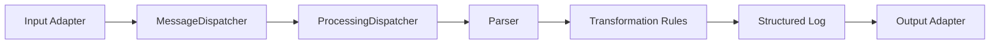

# Logparser

Logparser는 Spring Boot 기반 로그 수집, 파싱, 변환, 출력 파이프라인입니다. 파일, UDP, TCP, HTTP, Kafka, SNMP, RabbitMQ 같은 입력에서 이벤트를 받아 파서와 변환 규칙을 적용한 뒤 파일, HTTP, OpenSearch, Kafka, Debug 출력으로 전달합니다.

런타임 설정은 REST API와 정적 웹 UI에서 관리하며, SQLite와 Flyway를 사용해 로컬 데이터베이스에 저장합니다.

## 주요 기능

- 여러 입력 어댑터를 통한 로그, 메시지, 메트릭 이벤트 수집
- JSON, regex, delimiter, fixed length, key-value 기반 파싱
- 필드 이름 변경, 값 치환, 타입 변환, 필드 추가/삭제 같은 변환 규칙
- OpenSearch, Kafka, HTTP, 파일, 디버그 출력 지원
- SQLite 기반 설정 저장과 Flyway migration
- REST API와 브라우저 관리 UI
- 입력별 timeout, worker thread, queue size 기반 처리 제한

## 기술 스택

- Java 21
- Spring Boot 3
- Gradle
- SQLite JDBC
- Flyway
- SNMP4J
- JUnit 5
- Docker / Docker Compose

## 프로젝트 구조

```text
src/main/java/org/keinus/logparser/
  application/pipeline/          # 런타임 로그 처리 파이프라인
  domain/configuration/          # 설정 모델, 저장/검증 서비스
  domain/input/                  # 입력 어댑터
  domain/output/                 # 출력 어댑터
  domain/parse/                  # 파서 모델
  domain/transformation/         # 변환 규칙 모델
  infrastructure/persistence/    # SQLite 저장소와 DB loader
  interfaces/controller/         # REST API

src/main/resources/
  static/                        # 관리 UI 정적 파일
  db/migration/                  # Flyway migration

src/test/                        # JUnit 테스트
```

## 빠른 시작

Java 21이 필요합니다.

```powershell
.\gradlew bootRun
```

기본 포트는 `8765`입니다.

- 관리 UI: `http://localhost:8765`
- API base URL: `http://localhost:8765/api/v1`
- Health check: `http://localhost:8765/actuator/health`

테스트와 빌드는 다음 명령으로 실행합니다.

```powershell
.\gradlew test
.\gradlew build
```

Gradle이 Java를 찾지 못하면 PowerShell에서 Java 21 설치 경로를 지정합니다.

```powershell
$env:JAVA_HOME='C:\Path\To\Java21'
.\gradlew test
```

## Docker 실행

```powershell
docker build -t logparser .
docker run -p 8765:8765 logparser
```

Compose를 사용할 수도 있습니다.

```powershell
docker compose up --build
```

## 파이프라인 개요



입력 어댑터는 원본 이벤트를 `LogEvent`로 만들고 dispatcher에 전달합니다. 파싱, 변환, 출력은 파이프라인의 뒤쪽 단계에서 처리합니다.

## 입력 어댑터

| Type | 설명 |
| --- | --- |
| `FileInputAdapter` | 파일 tail 기반 로그 수집 |
| `UdpInputAdapter` | UDP socket 기반 로그 수집 |
| `TcpInputAdapter` | TCP socket 기반 로그 수집 |
| `HttpInputAdapter` | HTTP endpoint 이벤트 수집 |
| `KafkaInputAdapter` | Kafka topic 메시지 수집 |
| `SnmpInputAdapter` | SNMP v1/v2c/v3 polling 기반 장비 메트릭 수집 |
| `RabbitMqInputAdapter` | RabbitMQ queue 메시지 수집 |

공통 설정 필드는 다음과 같습니다.

| Field | 설명 |
| --- | --- |
| `type` | 입력 어댑터 타입 |
| `messagetype` | 파서 매칭에 사용할 메시지 타입 |
| `timeoutMs` | 입력 처리 timeout |
| `workerThreads` | 입력 처리 worker 수 |
| `queueSize` | 입력 queue 크기 |
| `enabled` | 활성화 여부 |
| `configParams` | 어댑터별 JSON 설정 |

## SNMP 수집 예시

`SnmpInputAdapter`는 여러 target과 여러 OID를 주기적으로 polling하고, 각 응답을 JSON 문자열 형태의 `LogEvent`로 전달합니다. 현재 구현은 SNMP v1/v2c community 기반 수집과 SNMPv3 USM 기반 수집을 지원합니다.

예시 설정:

```json
{
  "intervalMs": 60000,
  "retries": 1,
  "targets": [
    {
      "name": "sw-core-01",
      "host": "192.0.2.10",
      "port": 161,
      "community": "public",
      "version": "2c"
    }
  ],
  "oids": [
    {
      "name": "sysName",
      "oid": "1.3.6.1.2.1.1.5.0"
    },
    {
      "name": "ifNumber",
      "oid": "1.3.6.1.2.1.2.1.0"
    }
  ]
}
```

SNMPv3 `authPriv` 예시:

```json
{
  "intervalMs": 60000,
  "retries": 1,
  "targets": [
    {
      "name": "fw-edge-01",
      "host": "192.0.2.20",
      "port": 161,
      "version": "3",
      "securityName": "poller",
      "securityLevel": "authPriv",
      "authProtocol": "SHA256",
      "authPassphraseEnv": "SNMP_AUTH_PASSPHRASE",
      "privProtocol": "AES128",
      "privPassphraseEnv": "SNMP_PRIV_PASSPHRASE"
    }
  ],
  "oids": [
    {
      "name": "sysName",
      "oid": "1.3.6.1.2.1.1.5.0"
    }
  ]
}
```

API 등록 예시:

```powershell
curl -X POST http://localhost:8765/api/v1/input-adapters `
  -H 'Content-Type: application/json' `
  -d '{
    "type": "SnmpInputAdapter",
    "messagetype": "snmp-metrics",
    "timeoutMs": 1500,
    "workerThreads": 10,
    "queueSize": 1000,
    "enabled": true,
    "configParams": "{\"intervalMs\":60000,\"retries\":1,\"targets\":[{\"name\":\"sw-core-01\",\"host\":\"192.0.2.10\",\"port\":161,\"community\":\"public\",\"version\":\"2c\"}],\"oids\":[{\"name\":\"sysName\",\"oid\":\"1.3.6.1.2.1.1.5.0\"}]}"
  }'
```

운영 기준으로 20-150대 규모를 수집하려면 target 수, OID 수, `intervalMs`, `timeoutMs`, `retries`를 함께 조정해야 합니다. 예를 들어 150대에 OID 10개를 60초마다 polling하면 한 주기에 1500개 요청이 발생합니다. timeout이 길거나 retry가 많으면 다음 주기와 겹칠 수 있으므로 timeout과 interval을 보수적으로 잡는 것이 좋습니다.

SNMP community나 SNMPv3 passphrase 같은 민감 값은 `configParams`에 저장될 수 있으므로 운영 환경에서는 접근 권한과 DB 보관 정책을 별도로 관리해야 합니다. SNMPv3 passphrase는 `authPassphraseEnv`, `privPassphraseEnv`로 환경 변수 참조를 사용하는 방식을 권장합니다.

## RabbitMQ 입력 예시

`RabbitMqInputAdapter`는 지정된 queue에서 `basicGet` 방식으로 메시지를 polling하고 메시지 본문을 `LogEvent` 원문으로 전달합니다. 기본값은 `autoAck=false`이며, 메시지를 읽어 이벤트로 만들기 전에 delivery tag를 ack 처리합니다.

예시 설정:

```json
{
  "queue": "logs.input",
  "username": "guest",
  "password": "guest",
  "virtualHost": "/",
  "autoAck": false,
  "prefetchCount": 10,
  "declareQueue": false
}
```

queue를 어댑터가 생성해야 하는 환경에서는 `declareQueue=true`를 사용할 수 있습니다. exchange와 binding까지 필요하면 다음 필드를 추가합니다.

```json
{
  "queue": "logs.input",
  "exchange": "logs.topic",
  "routingKey": "logs.#",
  "declareQueue": true,
  "bindQueue": true
}
```

API 등록 예시:

```powershell
curl -X POST http://localhost:8765/api/v1/input-adapters `
  -H 'Content-Type: application/json' `
  -d '{
    "type": "RabbitMqInputAdapter",
    "messagetype": "rabbit-logs",
    "host": "rabbit.local",
    "port": 5672,
    "timeoutMs": 5000,
    "enabled": true,
    "configParams": "{\"queue\":\"logs.input\",\"username\":\"guest\",\"password\":\"guest\",\"virtualHost\":\"/\",\"autoAck\":false,\"prefetchCount\":10}"
  }'
```

RabbitMQ password 같은 민감 값도 `configParams`에 저장될 수 있으므로 운영 환경에서는 DB 접근 권한과 secret 관리 방식을 별도로 정해야 합니다.

## 파서

| Type | 설명 |
| --- | --- |
| `JsonParser` | JSON 로그를 필드로 파싱 |
| `RegexParser` | 정규식 capture group 기반 파싱 |
| `DelimiterParser` | 구분자 기반 파싱 |
| `FixedLengthParser` | 고정 길이 필드 파싱 |
| `KeyValueParser` | key=value 형태 파싱 |

SNMP 수집 이벤트는 JSON 문자열로 생성되므로 일반적으로 `JsonParser`와 함께 사용합니다. RabbitMQ 입력은 메시지 본문을 그대로 전달하므로 queue에 들어오는 payload 형식에 맞는 파서를 연결합니다.

## 출력 어댑터

| Type | 설명 |
| --- | --- |
| `FileOutputAdapter` | 파일 출력 |
| `HttpOutputAdapter` | HTTP endpoint 전송 |
| `OpenSearchOutputAdapter` | OpenSearch index 전송 |
| `KafkaOutputAdapter` | Kafka topic 전송 |
| `ClickHouseOutputAdapter` | ClickHouse HTTP endpoint에 이벤트 저장 |
| `DebugOutputAdapter` | 로그/디버그 출력 |

### ClickHouseOutputAdapter

`ClickHouseOutputAdapter`는 `LogEvent.toOutputMap()` 결과를 `event_json` 문자열로 저장하고, 조회에 자주 쓰는 `agent_id`, `tenant_id`, `source_id`, `item_kind`, `item_type`, `item_key`를 별도 컬럼으로 함께 전송합니다. ClickHouse HTTP API를 사용하므로 별도 JDBC 드라이버가 필요하지 않습니다.

예시:

```json
{
  "type": "ClickHouseOutputAdapter",
  "messagetype": "castrelyx-agent-item",
  "enabled": true,
  "configParams": "{\"endpointUrl\":\"http://clickhouse:8123\",\"database\":\"default\",\"tableName\":\"castrelyx_agent_events\",\"usernameEnv\":\"CLICKHOUSE_USER\",\"passwordEnv\":\"CLICKHOUSE_PASSWORD\",\"batchSize\":100,\"flushIntervalMs\":5000,\"autoCreateSchema\":true}"
}
```

`usernameEnv`, `passwordEnv`는 선택 사항입니다. 둘 다 지정하면 Basic 인증 헤더로 전송하고, 지정하지 않으면 인증 없이 요청합니다. `autoCreateSchema=true`이면 `MergeTree` 기반 기본 테이블을 생성합니다.

## REST API 요약

| Method | Path | 설명 |
| --- | --- | --- |
| `GET` | `/api/v1/input-adapters` | 입력 어댑터 목록 조회 |
| `POST` | `/api/v1/input-adapters` | 입력 어댑터 생성 |
| `PUT` | `/api/v1/input-adapters/{id}` | 입력 어댑터 수정 |
| `DELETE` | `/api/v1/input-adapters/{id}` | 입력 어댑터 삭제 |
| `GET` | `/api/v1/parsers` | 파서 목록 조회 |
| `POST` | `/api/v1/parsers` | 파서 생성 |
| `GET` | `/api/v1/output-adapters` | 출력 어댑터 목록 조회 |
| `POST` | `/api/v1/output-adapters` | 출력 어댑터 생성 |
| `GET` | `/api/v1/config-metadata` | UI/API 설정 메타데이터 조회 |

상세 요청/응답 필드는 각 configuration model과 `ConfigMetadataService`의 schema 정의를 기준으로 합니다.

## 런타임 데이터와 설정

SQLite 설정 DB는 기본적으로 사용자 홈 아래에 생성됩니다.

```text
${user.home}/logparser/data/config.db
```

Flyway migration은 `src/main/resources/db/migration`에서 관리합니다. 새 adapter type이나 DB 제약을 추가하면 기존 DB에도 적용될 migration을 함께 작성해야 합니다.

## 개발 시 주의사항

- 생성 산출물과 런타임 DB를 커밋하지 않습니다.
- 입력 어댑터는 `close()`에서 socket, scheduler, executor 같은 리소스를 정리해야 합니다.
- 새 설정 필드를 추가하면 저장, 로드, 검증, metadata, README를 함께 갱신합니다.
- 네트워크 수집 기능은 timeout, retry, queue size를 명시적으로 제한합니다.
- 완료 전 `.\gradlew test`로 회귀를 확인합니다.

## 라이선스

프로젝트 라이선스는 저장소의 라이선스 파일 또는 배포 정책을 따릅니다.
