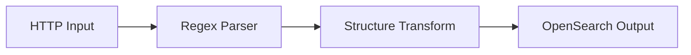

# Diagram Samples

이 문서는 `markdown-viewer.html`이 Mermaid와 StarUML 코드블록을 렌더링하는지 확인하기 위한 샘플입니다.

## Mermaid



## StarUML

```staruml
{
  "_type": "Project",
  "_id": "project-1",
  "name": "Viewer Sample",
  "ownedElements": [
    {
      "_type": "UMLClassDiagram",
      "_id": "diagram-1",
      "name": "Authentication Domain"
    },
    {
      "_type": "UMLClass",
      "_id": "class-user",
      "name": "User",
      "attributes": [
        { "name": "id", "visibility": "private", "type": "Long" },
        { "name": "email", "visibility": "private", "type": "String" }
      ],
      "operations": [
        {
          "name": "login",
          "visibility": "public",
          "parameters": [
            { "name": "password", "type": "String" }
          ]
        }
      ]
    },
    {
      "_type": "UMLInterface",
      "_id": "interface-authenticatable",
      "name": "Authenticatable",
      "operations": [
        { "name": "authenticate", "visibility": "public" }
      ]
    },
    {
      "_type": "UMLEnumeration",
      "_id": "enum-role",
      "name": "Role",
      "attributes": [
        { "name": "ADMIN" },
        { "name": "USER" }
      ]
    },
    {
      "_type": "UMLAssociation",
      "_id": "association-user-role",
      "name": "has role",
      "end1": {
        "reference": { "$ref": "class-user" }
      },
      "end2": {
        "reference": { "$ref": "enum-role" }
      }
    },
    {
      "_type": "UMLInterfaceRealization",
      "_id": "realization-auth",
      "contract": { "$ref": "interface-authenticatable" },
      "implementingClassifier": { "$ref": "class-user" }
    }
  ]
}
```
