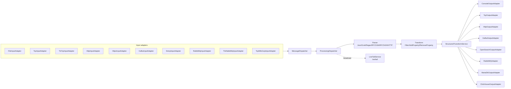
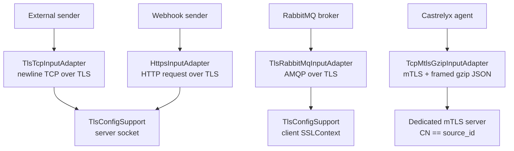
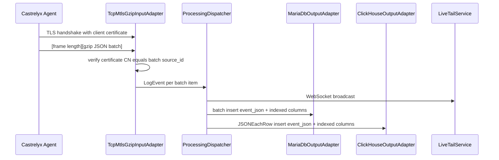
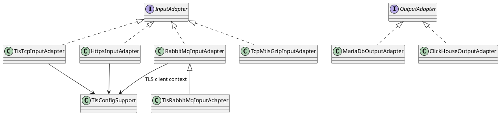

# Diagram Samples

이 파일은 Logparser 문서 화면에서 Mermaid와 StarUML/PlantUML류 다이어그램 렌더링을 확인하기 위한 샘플입니다. 다이어그램 내용은 현재 구현된 pipeline, input/output adapter, Castrelyx agent ingest 경로를 기준으로 합니다.

## Mermaid: Runtime Pipeline

## Mermaid: TLS Input Choices

## Mermaid: Castrelyx Agent Event Storage

## PlantUML/Class Diagram Sample

