# LogParser 상세 사용 매뉴얼

대상 서버: `http://192.168.50.21:8765`  
작성 기준: 2026-06-15 실제 배포 화면 및 `/api/v1` 메타데이터 확인 결과

이 문서는 LogParser 운영자가 웹 콘솔에서 로그 수집 파이프라인을 조회하고, 입력 소스, 파서, 이벤트 규칙, 스키마 매핑, 출력 대상을 설정하는 방법을 설명합니다. 예시 입력값은 매뉴얼 작성을 위한 샘플이며, 운영 환경에 저장하기 전에 포트, 호스트, 인증 정보, 테이블명, 토픽명, `messageType`을 실제 값으로 바꿔야 합니다.

## 1. 접속 및 기본 화면

브라우저에서 다음 주소로 접속합니다.

```text
http://192.168.50.21:8765
```

현재 배포 화면은 별도 로그인 화면 없이 LogParser 콘솔로 진입합니다. 화면 왼쪽에는 메뉴가 있고, 오른쪽 상단에는 검색창, 알림 아이콘, `Actions` 버튼이 있습니다. 상단 상태 배지가 `RUNNING`이면 파이프라인이 실행 중입니다.

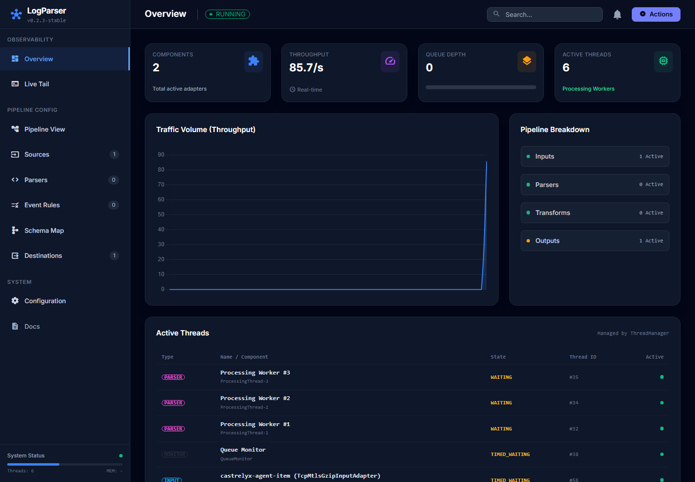

### 화면 구성

| 영역 | 설명 |
| --- | --- |
| `Overview` | 전체 컴포넌트 수, 처리량, 큐 깊이, 활성 스레드 상태를 봅니다. |
| `Live Tail` | 파이프라인 이벤트 스트림을 실시간으로 확인합니다. |
| `Pipeline View` | `messageType` 기준으로 입력, 처리, 출력 연결 상태를 봅니다. |
| `Sources` | 입력 어댑터를 생성, 수정, 삭제, 활성화합니다. |
| `Parsers` | JSON, Regex, Grok, Syslog 등 파서를 설정하고 테스트합니다. |
| `Event Rules` | 필터, 필드 추가, 필드 제거 규칙을 설정합니다. |
| `Schema Map` | 파싱된 필드를 공통/서브 테이블 스키마로 매핑합니다. |
| `Destinations` | Console, TCP, HTTP, Kafka, OpenSearch, MariaDB, ClickHouse 등 출력 대상을 설정합니다. |
| `Configuration` | parser/transform 처리 스레드 수 같은 시스템 설정을 조정합니다. |
| `Docs` | 서버에 포함된 문서 뷰어로 이동합니다. |

### 중요한 공통 개념

`Message Type (ID)`는 파이프라인을 묶는 핵심 키입니다. 입력 소스가 `castrelyx-agent-item`으로 이벤트를 만들면, 같은 `messageType`을 가진 파서, 이벤트 규칙, 스키마 매핑, 출력 대상이 한 흐름으로 연결됩니다. 값이 하나라도 다르면 화면에는 설정이 있어도 실제 처리 체인에 연결되지 않을 수 있습니다.

`Enabled` 토글은 입력과 출력 어댑터에서 실제 동작 여부를 결정합니다. 설정만 만들어 두고 비활성화하면 목록에는 보이지만 파이프라인에는 사용되지 않습니다.

## 2. Overview: 상태 모니터링

`Overview` 화면은 접속 직후 기본 화면입니다.

사용자가 입력할 값은 없습니다. 다음 항목을 확인합니다.

| 항목 | 확인 내용 |
| --- | --- |
| `Components` | 활성 입력, 파서, 변환, 출력 컴포넌트 합계입니다. |
| `Throughput` | 초당 처리 이벤트 수입니다. |
| `Queue Depth` | 내부 큐에 쌓인 이벤트 수입니다. 계속 증가하면 처리 지연 가능성이 있습니다. |
| `Active Threads` | 현재 관리 중인 스레드 수입니다. |
| `Traffic Volume` | 최근 처리량 추이를 그래프로 보여줍니다. |
| `Pipeline Breakdown` | Inputs, Parsers, Transforms, Outputs 별 활성 수를 보여줍니다. |
| `Active Threads` 표 | 스레드 타입, 이름, 상태, ID, alive 여부를 확인합니다. |

운영 중 이상 징후는 다음 기준으로 판단합니다.

| 증상 | 의미 | 조치 |
| --- | --- | --- |
| 상태가 `RUNNING`이 아님 | 파이프라인이 중지되었거나 재시작 중일 수 있습니다. | `Actions`에서 `Validate Config Integrity` 확인 후 필요 시 재시작합니다. |
| `Queue Depth`가 계속 증가 | 입력보다 처리/출력이 느립니다. | 출력 대상 장애, 네트워크 지연, 스레드 수 부족을 확인합니다. |
| `Throughput`이 0 | 입력이 없거나 입력 어댑터가 비활성화되었을 수 있습니다. | `Sources`, `Pipeline View`, 외부 로그 송신 상태를 확인합니다. |

## 3. Pipeline View: 파이프라인 연결 확인

왼쪽 메뉴에서 `Pipeline View`를 클릭합니다.

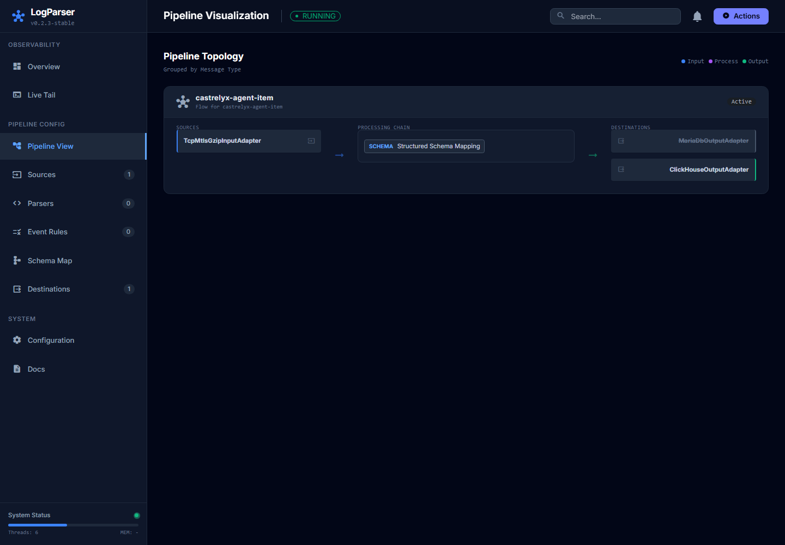

이 화면은 `messageType`별 처리 흐름을 보여줍니다. 현재 캡처 기준으로 `castrelyx-agent-item` 흐름은 다음과 같이 보입니다.

| 단계 | 예시 |
| --- | --- |
| Sources | `TcpMtlsGzipInputAdapter` |
| Processing Chain | `Structured Schema Mapping` |
| Destinations | `MariaDbOutputAdapter`, `ClickHouseOutputAdapter` |

카드를 클릭하면 해당 설정 화면으로 이동합니다. 운영자는 새 설정을 만들기 전에 이 화면에서 같은 `messageType`의 입력과 출력이 연결되는지 먼저 확인하는 것이 좋습니다.

## 4. Live Tail: 실시간 이벤트 확인

왼쪽 메뉴에서 `Live Tail`을 클릭합니다.

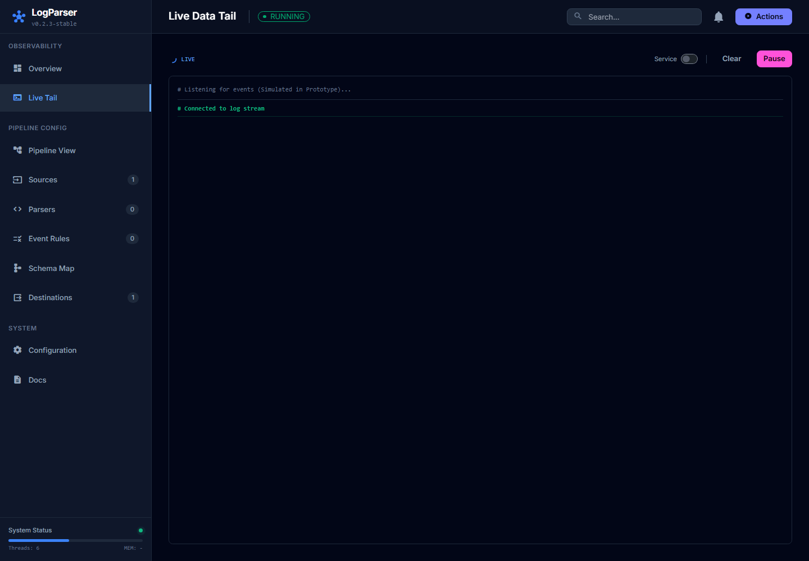

### 사용 방법

| 컨트롤 | 사용 방법 | 영향 |
| --- | --- | --- |
| `Service` 토글 | Live Tail 서비스 자체를 켜거나 끕니다. | 서버 설정에 영향을 줍니다. 운영 중에는 임의로 변경하지 마십시오. |
| `Clear` | 현재 화면에 쌓인 로그 표시만 지웁니다. | 서버 데이터에는 영향이 없습니다. |
| `Pause` / `Resume` | 화면 갱신을 일시 정지하거나 재개합니다. | 서버 데이터에는 영향이 없습니다. |

실시간 이벤트가 들어오면 터미널 영역에 ISO 시간, `messageType`, 이벤트 JSON이 표시됩니다. 이벤트가 보이지 않으면 입력 어댑터 활성화 여부, 외부 로그 송신 여부, `messageType` 연결 상태를 확인합니다.

## 5. Sources: 입력 소스 관리

왼쪽 메뉴에서 `Sources`를 클릭합니다.

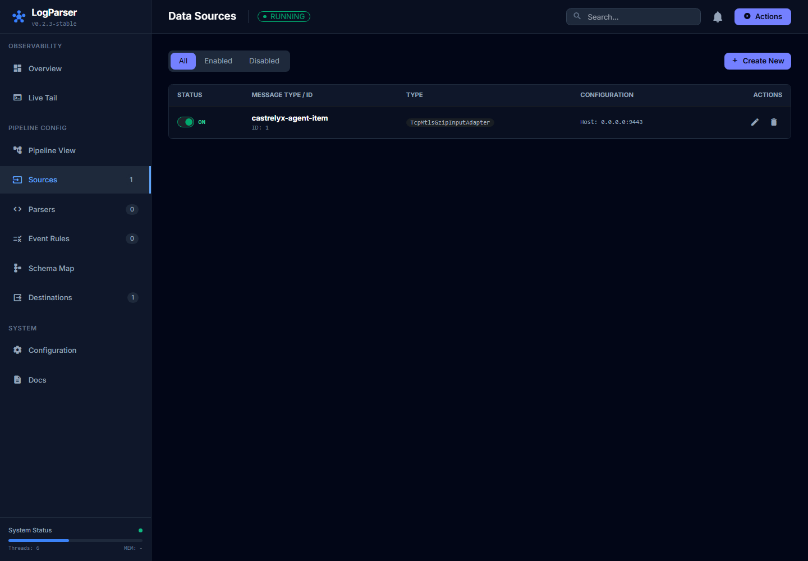

### 목록 화면 사용법

| 항목 | 설명 |
| --- | --- |
| `All`, `Enabled`, `Disabled` | 전체, 활성, 비활성 입력 어댑터만 필터링합니다. |
| `Create New` | 새 입력 어댑터를 만듭니다. |
| 연필 아이콘 | 기존 입력 어댑터를 수정합니다. |
| 휴지통 아이콘 | 입력 어댑터를 삭제합니다. 삭제 전 확인창이 뜹니다. |
| `Enabled` 토글 | 입력 어댑터를 활성/비활성 전환합니다. |

### 입력 소스 생성 절차

1. `Sources` 화면에서 `Create New`를 클릭합니다.
2. `Adapter Type`을 선택합니다.
3. `Message Type (ID)`를 입력합니다. 예: `network-snmp`, `castrelyx-agent-item`
4. 타입별 필수 필드를 입력합니다.
5. 운영에 바로 사용할 설정이면 `Enabled`를 켭니다.
6. `Save Configuration`을 클릭합니다.
7. 필요하면 `Actions`에서 `Validate Config Integrity` 또는 `Reload Configuration (Hot)`을 실행합니다.

### 입력 타입별 필드

| Adapter Type | 필수 입력 | 선택 입력 | 용도 |
| --- | --- | --- | --- |
| `TcpInputAdapter` | `port` | 없음 | TCP 포트에서 원문 로그를 수신합니다. |
| `UdpInputAdapter` | `port` | 없음 | UDP 데이터그램 로그를 수신합니다. |
| `HttpInputAdapter` | `port` | `path_pattern` | HTTP endpoint로 이벤트를 받습니다. |
| `KafkaInputAdapter` | `bootstrapservers`, `topicid` | `groupId` | Kafka topic을 consume합니다. |
| `SnmpInputAdapter` | `configParams` | `timeoutMs`, `queueSize`, `workerThreads` | SNMP v1/v2c/v3 target을 polling합니다. |
| `RabbitMqInputAdapter` | `configParams` | `host`, `port`, `timeoutMs` | RabbitMQ queue에서 메시지를 가져옵니다. |
| `TcpMtlsGzipInputAdapter` | `port`, `configParams` | 없음 | Castrelyx agent gzip batch를 TCP/mTLS로 수신합니다. |
| `FileInputAdapter` | `path` | `isFromBeginning` | 파일 tail 방식으로 로그를 읽습니다. |
| `FakeInputAdapter` | 없음 | 없음 | 테스트 이벤트를 생성합니다. |

### SNMP 입력 예시

다음 화면은 `SnmpInputAdapter`를 만드는 예시입니다. 실제 운영에서는 target host, community, OID를 장비에 맞게 바꿉니다.

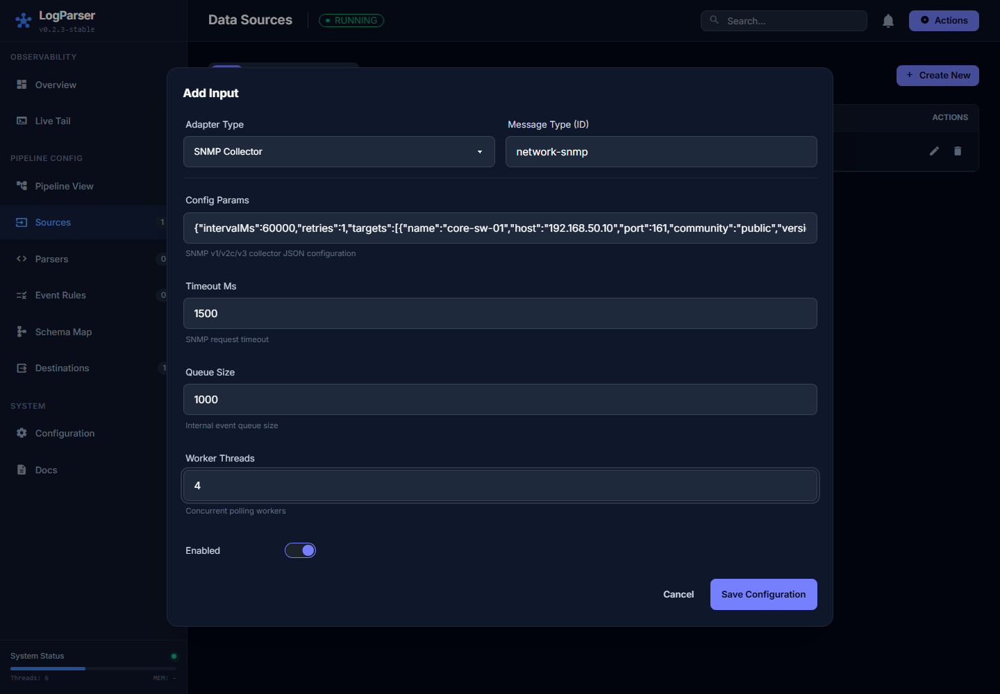

입력값 예시:

| 필드 | 값 |
| --- | --- |
| `Adapter Type` | `SNMP Collector` |
| `Message Type (ID)` | `network-snmp` |
| `Config Params` | 아래 JSON 문자열 |
| `Timeout Ms` | `1500` |
| `Queue Size` | `1000` |
| `Worker Threads` | `4` |
| `Enabled` | 활성화할 경우 ON |

`Config Params` 예시:

```json
{
  "intervalMs": 60000,
  "retries": 1,
  "targets": [
    {
      "name": "core-sw-01",
      "host": "192.168.50.10",
      "port": 161,
      "community": "public",
      "version": "2c"
    }
  ],
  "oids": [
    {
      "name": "sysName",
      "oid": "1.3.6.1.2.1.1.5.0"
    }
  ]
}
```

주의사항:

- SNMP community, SNMPv3 passphrase, RabbitMQ password 등 민감 정보는 저장 DB에 남을 수 있습니다.
- 가능하면 `authPassphraseEnv`, `privPassphraseEnv`, `usernameEnv`, `passwordEnv`처럼 환경변수 참조 방식으로 운영합니다.
- SNMP target 수와 OID 수가 많으면 `intervalMs`, `timeoutMs`, `workerThreads`, `queueSize`를 함께 조정해야 합니다.

## 6. Parsers: 파서 설정 및 테스트

왼쪽 메뉴에서 `Parsers`를 클릭합니다.

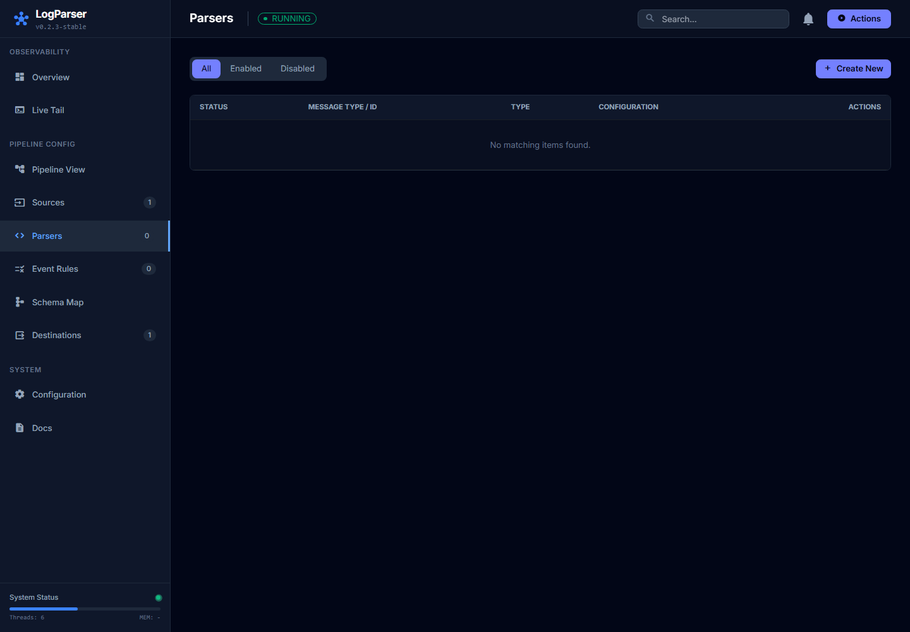

### 파서 생성 절차

1. `Parsers` 화면에서 `Create New`를 클릭합니다.
2. `Adapter Type`에서 파서 타입을 선택합니다.
3. `Message Type (ID)`를 입력합니다. 입력 소스의 `messageType`과 같아야 합니다.
4. 타입별 필드를 입력합니다.
5. Regex 또는 Grok 파서는 `Test Pattern` 영역에서 샘플 로그로 바로 검증합니다.
6. 결과가 의도한 필드로 나오면 `Save Configuration`을 클릭합니다.

### 파서 타입별 필드

| Parser Type | 필수 입력 | 용도 |
| --- | --- | --- |
| `JsonParser` | 없음 | JSON 원문을 필드로 파싱합니다. |
| `GrokParser` | `param` | Grok 패턴으로 필드를 추출합니다. |
| `RegexParser` | `param` | 정규식 capture group으로 key/value를 추출합니다. |
| `RFC3164SyslogParser` | 없음 | RFC3164 syslog를 파싱합니다. |
| `RFC5424SyslogParser` | 없음 | RFC5424 syslog를 파싱합니다. |
| `HttpParser` | 없음 | HTTP access log 형식을 파싱합니다. |

### Regex 파서 테스트 예시

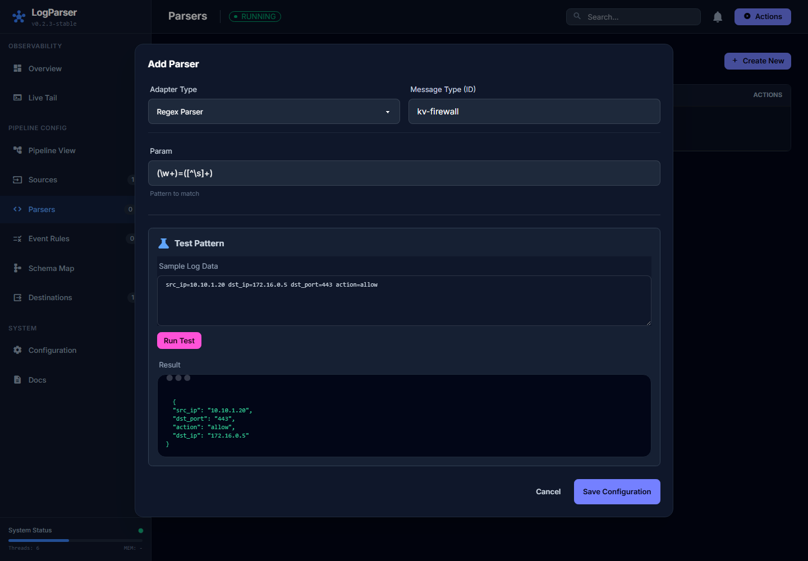

입력값 예시:

| 필드 | 값 |
| --- | --- |
| `Adapter Type` | `Regex Parser` |
| `Message Type (ID)` | `kv-firewall` |
| `Param` | `(\w+)=([^\s]+)` |
| `Sample Log Data` | `src_ip=10.10.1.20 dst_ip=172.16.0.5 dst_port=443 action=allow` |

`Run Test`를 누르면 결과 영역에 다음처럼 추출된 필드가 표시됩니다.

```json
{
  "src_ip": "10.10.1.20",
  "dst_port": "443",
  "action": "allow",
  "dst_ip": "172.16.0.5"
}
```

Regex 파서는 최소 2개의 capture group이 필요합니다. 첫 번째 group은 필드명, 두 번째 group은 값으로 사용됩니다.

## 7. Event Rules: 이벤트 변환 규칙

왼쪽 메뉴에서 `Event Rules`를 클릭합니다. 이 메뉴에서는 이벤트를 통과/폐기하거나 필드를 추가/삭제하는 규칙을 만듭니다.

### 변환 타입별 필드

| Transform Type | 필수 입력 | 선택 입력 | 용도 |
| --- | --- | --- | --- |
| `Filter` | 없음 | `pass`, `drop` | 조건에 맞는 이벤트만 통과시키거나 폐기합니다. |
| `AddProperty` | `add` | 없음 | 이벤트에 새 필드를 추가합니다. |
| `RemoveProperty` | `remove` | 없음 | 이벤트에서 지정 필드를 제거합니다. |

### AddProperty 예시

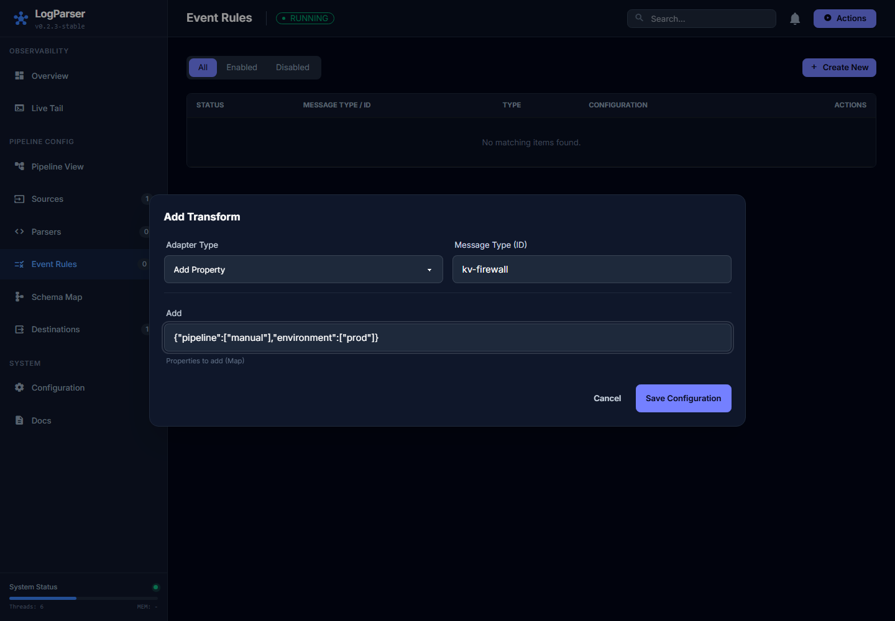

입력값 예시:

| 필드 | 값 |
| --- | --- |
| `Adapter Type` | `Add Property` |
| `Message Type (ID)` | `kv-firewall` |
| `Add` | `{"pipeline":["manual"],"environment":["prod"]}` |

운영 팁:

- 변환 규칙도 입력 소스와 같은 `messageType`을 사용해야 적용됩니다.
- `Filter`의 `pass`, `drop`은 조건 Map 형태로 입력합니다.
- `RemoveProperty`는 제거할 필드명을 쉼표로 입력하거나 JSON list 형태로 입력할 수 있습니다.
- 저장 후 실제 적용 여부는 `Pipeline View`와 `Actions > Validate Config Integrity`로 확인합니다.

## 8. Schema Map: 구조화 스키마 매핑

왼쪽 메뉴에서 `Schema Map`을 클릭합니다.

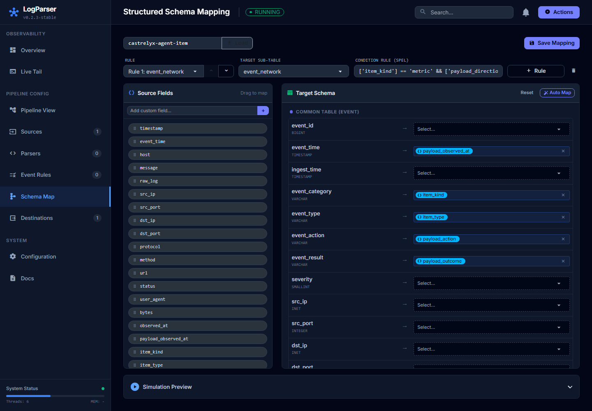

이 화면은 파싱된 source field를 표준 이벤트 스키마의 common table 및 sub table 필드에 연결합니다. 현재 서버에는 `event_network`, `event_web`, `event_auth` 서브 테이블이 제공됩니다.

### 기본 절차

1. 상단 `messageType` 입력칸에 매핑할 값을 입력합니다. 예: `castrelyx-agent-item`
2. `Load`를 클릭합니다.
3. `Source Fields`에서 필드를 끌어 오른쪽 `Target Schema`의 대상 필드에 놓습니다.
4. 또는 대상 필드의 `Select...` 드롭다운에서 source field를 선택합니다.
5. `Target Sub-Table`을 선택합니다. 예: `event_network`, `event_web`, `event_auth`
6. 필요하면 `Condition Rule (SpEL)`을 입력합니다.
7. `Auto Map`으로 이름이 비슷한 필드를 자동 매핑할 수 있습니다.
8. `Simulation Preview`에 샘플 JSON을 넣고 시뮬레이션합니다.
9. 결과가 맞으면 `Save Mapping`을 클릭합니다.

### 주요 입력 항목

| 항목 | 설명 | 예시 |
| --- | --- | --- |
| `messageType` | 매핑 대상 이벤트 타입 | `castrelyx-agent-item` |
| `Rule` | 서브 테이블 매핑 규칙 순서 | `Rule 1: event_network` |
| `Target Sub-Table` | 이벤트 상세 테이블 | `event_network` |
| `Condition Rule (SpEL)` | 이 규칙을 적용할 조건 | `['item_kind'] == 'metric'` |
| `Add custom field` | source field 목록에 수동 필드 추가 | `payload_observed_at` |
| `Auto Map` | 이름이 비슷한 필드를 자동 연결 | 클릭 |
| `Simulation Preview` | 샘플 데이터로 매핑 결과 검증 | JSON 입력 후 `Run Simulation` |

주의사항:

- `Save Mapping`은 서버 설정을 변경합니다. 운영 중에는 변경 전후 `Pipeline View`와 출력 데이터 상태를 확인하십시오.
- 조건식이 너무 넓으면 모든 이벤트가 같은 서브 테이블로 들어갈 수 있고, 너무 좁으면 매핑이 적용되지 않을 수 있습니다.
- source field가 목록에 없으면 `Add custom field`로 추가한 뒤 매핑합니다.

## 9. Destinations: 출력 대상 관리

왼쪽 메뉴에서 `Destinations`를 클릭합니다.

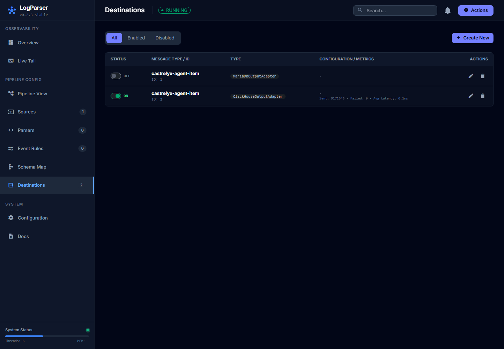

현재 캡처 기준으로 `MariaDbOutputAdapter`와 `ClickHouseOutputAdapter`가 보이며, `ClickHouseOutputAdapter`가 활성 상태입니다.

### 출력 대상 생성 절차

1. `Destinations` 화면에서 `Create New`를 클릭합니다.
2. `Adapter Type`을 선택합니다.
3. `Message Type (ID)`를 입력합니다. 출력할 입력/파서/매핑의 `messageType`과 같아야 합니다.
4. 타입별 필수 필드를 입력합니다.
5. 즉시 전송할 경우 `Enabled`를 켭니다.
6. `Save Configuration`을 클릭합니다.
7. `Actions`에서 설정 검증 또는 hot reload를 실행합니다.

### 출력 타입별 필드

| Adapter Type | 필수 입력 | 선택 입력 | 용도 |
| --- | --- | --- | --- |
| `ConsoleOutputAdapter` | 없음 | 없음 | 서버 콘솔에 출력합니다. |
| `TcpOutputAdapter` | `host`, `port` | `timeoutMs` | TCP로 이벤트를 전송합니다. |
| `HttpOutputAdapter` | `url` | `method`, `headers` | HTTP POST/PUT으로 이벤트를 전송합니다. |
| `KafkaOutputAdapter` | `bootstrapservers`, `topicid` | `key` | Kafka topic으로 produce합니다. |
| `OpenSearchOutputAdapter` | `url`, `index` | `osUsername`, `osPassword`, `action` | OpenSearch/Elasticsearch index에 저장합니다. |
| `RabbitMQAdapter` | `host`, `exchange`, `routingkey` | `rmqPort`, `rmqUsername`, `rmqPassword`, `tagpass` | RabbitMQ exchange로 publish합니다. |
| `MariaDbOutputAdapter` | `configParams` | 없음 | MariaDB에 Castrelyx 이벤트를 저장합니다. |
| `ClickHouseOutputAdapter` | `configParams` | 없음 | ClickHouse에 Castrelyx 이벤트를 저장합니다. |
| `BenchmarkAdapter` | 없음 | 없음 | 성능 측정용 출력입니다. |

### ClickHouse 출력 예시

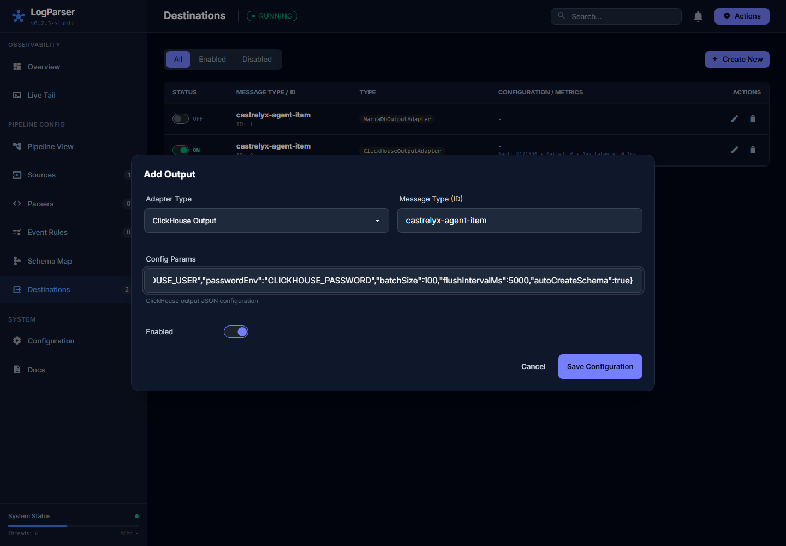

입력값 예시:

| 필드 | 값 |
| --- | --- |
| `Adapter Type` | `ClickHouse Output` |
| `Message Type (ID)` | `castrelyx-agent-item` |
| `Config Params` | 아래 JSON 문자열 |
| `Enabled` | 운영 전송 시 ON |

`Config Params` 예시:

```json
{
  "endpointUrl": "http://clickhouse:8123",
  "database": "castrelyx",
  "tableName": "castrelyx_agent_events",
  "usernameEnv": "CLICKHOUSE_USER",
  "passwordEnv": "CLICKHOUSE_PASSWORD",
  "batchSize": 100,
  "flushIntervalMs": 5000,
  "autoCreateSchema": true
}
```

MariaDB 출력은 JDBC 정보를 `configParams`로 입력합니다.

```json
{
  "jdbcUrl": "jdbc:mariadb://mariadb:3306/castrelyx",
  "usernameEnv": "CASTRELYX_DB_USER",
  "passwordEnv": "CASTRELYX_DB_PASSWORD",
  "tableName": "castrelyx_agent_events",
  "batchSize": 100,
  "flushIntervalMs": 5000,
  "autoCreateSchema": true
}
```

## 10. Configuration: 시스템 설정

왼쪽 메뉴에서 `Configuration`을 클릭합니다.

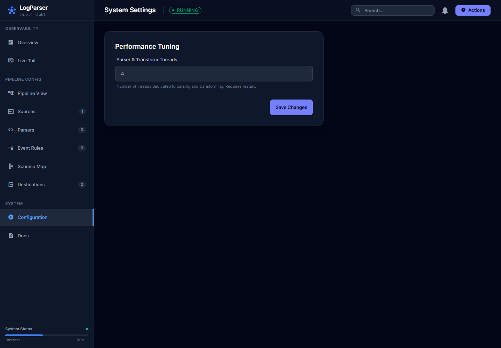

현재 화면에는 `Parser & Transform Threads` 설정이 보입니다. 이 값은 파싱과 변환에 사용할 스레드 수입니다.

사용 방법:

1. `Parser & Transform Threads`에 숫자를 입력합니다. 예: `4`, `8`
2. `Save Changes`를 클릭합니다.
3. 화면 설명처럼 재시작이 필요할 수 있습니다.

운영 중에는 CPU 사용량, 큐 깊이, 처리량을 함께 보고 조정합니다. 스레드를 무조건 크게 올리면 출력 대상 DB나 네트워크가 병목이 될 수 있습니다.

## 11. Actions: 파이프라인 제어

오른쪽 상단 `Actions` 버튼을 클릭합니다.

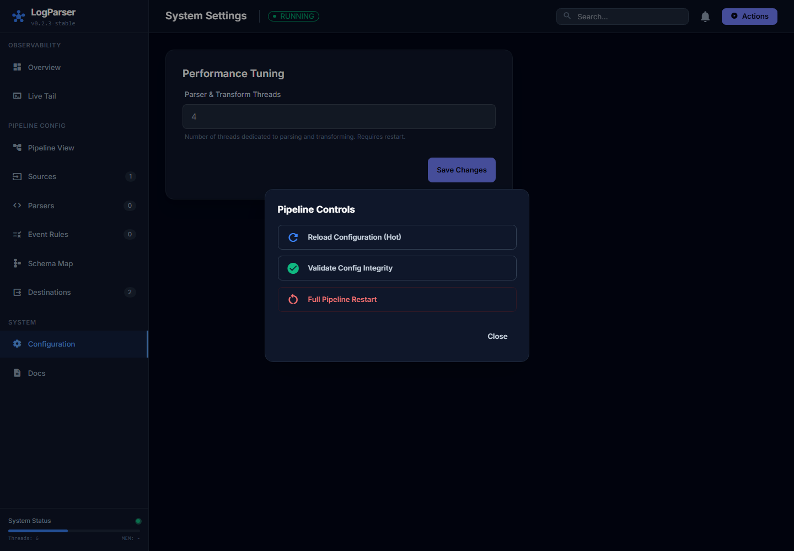

| 버튼 | 동작 | 사용 시점 |
| --- | --- | --- |
| `Reload Configuration (Hot)` | 저장된 설정을 재로딩합니다. | 어댑터/파서/매핑을 변경한 뒤 즉시 반영할 때 사용합니다. |
| `Validate Config Integrity` | 설정 무결성을 검증하고 재로딩합니다. | 신규 설정 저장 후 연결 오류를 확인할 때 사용합니다. |
| `Full Pipeline Restart` | 전체 파이프라인을 재시작합니다. | hot reload로 해결되지 않는 연결/스레드 문제를 복구할 때만 사용합니다. |

주의사항:

- `Full Pipeline Restart`는 현재 연결을 끊을 수 있습니다.
- 운영 중에는 먼저 `Validate Config Integrity`를 실행하고, 실패 메시지를 확인한 뒤 재시작 여부를 판단하십시오.
- 파이프라인 재시작 전에는 외부 송신 시스템이 재전송 또는 버퍼링을 지원하는지 확인하십시오.

## 12. API와 Swagger

웹 UI는 내부적으로 `/api/v1` REST API를 사용합니다. 필요한 경우 Swagger UI로 API 구조를 확인할 수 있습니다.

```text
http://192.168.50.21:8765/swagger-ui.html
```

주요 API:

| Method | Path | 용도 |
| --- | --- | --- |
| `GET` | `/api/v1/pipeline/status` | 파이프라인 상태 조회 |
| `GET` | `/api/v1/pipeline/topology` | messageType별 토폴로지 조회 |
| `GET` | `/api/v1/input-adapters` | 입력 어댑터 목록 조회 |
| `POST` | `/api/v1/input-adapters` | 입력 어댑터 생성 |
| `GET` | `/api/v1/parsers` | 파서 목록 조회 |
| `POST` | `/api/v1/parsers/test` | 파서 패턴 테스트 |
| `GET` | `/api/v1/transforms` | 이벤트 규칙 목록 조회 |
| `GET` | `/api/v1/output-adapters` | 출력 어댑터 목록 조회 |
| `GET` | `/api/v1/structure/schema` | 구조화 스키마 조회 |
| `POST` | `/api/v1/structure/mapping` | 스키마 매핑 저장 |
| `GET` | `/api/v1/settings` | 시스템 설정 조회 |

예시 상태 확인:

```powershell
Invoke-RestMethod http://192.168.50.21:8765/api/v1/pipeline/status
```

## 13. 운영 점검 체크리스트

신규 로그 흐름을 만들 때는 다음 순서로 확인합니다.

1. `Sources`에서 입력 어댑터를 만들고 `Enabled`를 켭니다.
2. 입력과 같은 `Message Type (ID)`로 `Parsers`를 만듭니다.
3. Regex/Grok 파서는 `Run Test`로 샘플 로그 파싱 결과를 확인합니다.
4. 필요한 경우 `Event Rules`로 필드 추가/삭제/필터를 설정합니다.
5. `Schema Map`에서 같은 `messageType`을 로드하고 source field를 target schema에 매핑합니다.
6. `Destinations`에서 같은 `messageType`의 출력 어댑터를 만들고 `Enabled`를 켭니다.
7. `Actions > Validate Config Integrity`를 실행합니다.
8. `Pipeline View`에서 입력, 처리, 출력이 한 줄로 연결되는지 확인합니다.
9. `Overview`에서 throughput과 queue depth를 확인합니다.
10. `Live Tail` 또는 출력 DB에서 실제 이벤트가 도착하는지 확인합니다.

## 14. 문제 해결

| 문제 | 확인할 곳 | 조치 |
| --- | --- | --- |
| 이벤트가 처리되지 않음 | `Pipeline View` | 입력, 파서, 출력의 `messageType`이 같은지 확인합니다. |
| 입력은 있는데 출력이 없음 | `Destinations` | 출력 어댑터가 `Enabled`인지, 대상 DB/브로커 연결 정보가 맞는지 확인합니다. |
| Regex 결과가 비어 있음 | `Parsers > Test Pattern` | 정규식에 key/value용 capture group 2개 이상이 있는지 확인합니다. |
| 큐가 계속 증가 | `Overview > Queue Depth`, `Active Threads` | 출력 대상 장애, 느린 네트워크, worker thread 부족을 확인합니다. |
| 스키마 매핑이 적용되지 않음 | `Schema Map`, `Pipeline View` | 매핑 저장 여부, 조건식, `messageType`을 확인하고 hot reload합니다. |
| 저장 후 반영이 안 됨 | `Actions` | `Validate Config Integrity` 또는 `Reload Configuration (Hot)`을 실행합니다. |
| 화면 목록 수가 실제와 다름 | 브라우저 새로고침 | 저장 후 화면 새로고침 또는 메뉴 재진입을 합니다. |

## 15. 변경성 작업 주의

다음 작업은 서버 설정 또는 파이프라인 동작을 바꿉니다.

- `Save Configuration`
- `Save Mapping`
- 입력/출력 `Enabled` 토글
- `Delete`
- `Reload Configuration (Hot)`
- `Validate Config Integrity`
- `Full Pipeline Restart`
- `Live Tail`의 `Service` 토글
- `Configuration > Save Changes`

운영 서버에서 위 작업을 수행할 때는 변경 대상 `messageType`, 영향받는 입력/출력, 외부 시스템 재전송 가능 여부를 확인한 뒤 진행하십시오.
