# Logparser UI 재검토 — Pipeline Studio와 전체 화면의 일관성

검토일: 2026-08-27

대상: 실행 중인 `http://localhost:8765`의 Logparser 관리 UI와 현재 작업 트리의 구현

상태: **검토 완료 / 제품 코드 변경 없음 / 통합 방향 제안**

## 1. 결론

Pipeline Studio와 기존 화면은 같은 제품 안에서 **서로 다른 탐색 구조, 디자인 규칙, 편집 방식을 사용한다.** 문서 화면까지 포함하면 세 번째 시각 체계가 존재한다. 사용자가 느끼는 단절은 화면의 색상 차이뿐 아니라, 메뉴를 이동할 때 위치·이름·작업 대상·저장 의미가 함께 바뀌는 데서 발생한다.

권장 방향은 **하나의 공통 사이드바와 헤더, 하나의 편집기, 명시적인 message type 컨텍스트**다. Studio의 흐름–설정–테스트 구조는 유지하고, 목록·대시보드·문서에는 각 작업에 맞는 본문을 둔다. 모든 화면을 Studio의 다중 패널로 바꿀 필요는 없다.

## 2. 검토 범위와 방법

- 기본 viewport `1280 × 720`, 좁은 화면 `390 × 844`에서 현재 화면을 캡처했다.
- 캡처 직전에 실제 DOM을 확인하고, 저장한 이미지를 다시 열어 검사했다. 아래 JPEG는 이번 실행에서 확보한 원본이며 재인코딩하거나 편집하지 않았다. viewport 설정 크기와 도구가 반환한 이미지 픽셀 크기는 다를 수 있다.
- 탐색, 기존 Input 편집 모달 열기/취소, 문서에서 뒤로 가기, Studio의 로컬 Validate 동작을 확인했다.
- Save, Deploy, 활성화 변경, 삭제, 템플릿 적용, 파이프라인 재시작은 실행하지 않았다. 운영 설정은 변경하지 않았다.
- Sources를 공통 목록과 편집 모달의 대표 화면으로 검사했다. Parsers·Event Rules·Destinations는 같은 목록 렌더러를 사용하는 코드까지 확인했으며, 모든 타입의 폼을 각각 실측한 것은 아니다.
- Manager, CastrelVault, 독립 레거시 HTML 진입점, 실제 이벤트 유입/재연결, 모든 키보드 경로와 스크린리더는 이번 범위에 포함하지 않았다.

## 3. 화면별 근거

### 01. Pipeline Studio — 구조는 유용하지만 공통 틀과 분리됨

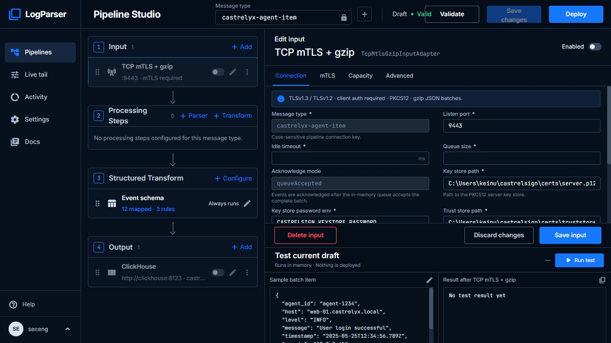

- 장점: 처리 단계, 선택한 설정, 테스트 영역을 한 작업 공간에서 볼 수 있다. 설정을 항목별로 편집할 수 있다.
- 문제: Studio 전용 메뉴 5개, 폭 170px, 파란 CTA, 작은 곡률/간격을 사용한다. 다른 화면의 메뉴와 이름이 다르다.
- 상태 위험: Input·Output이 비활성인데 첫 진입의 헤더는 `Draft · Valid`다. 실제 검증 결과는 11번과 다르다.
- 화면 밀도: 여러 독립 스크롤과 작은 설명문이 겹친다. 고정된 설정/테스트 분할은 긴 폼의 가용 높이를 제한한다.
- 접근성: 현재 Input 폼의 비-checkbox 입력 13개는 DOM에서 연결된 label과 `aria-label`/`aria-labelledby`가 모두 없었다. 눈에 보이는 레이블만으로 보조기술 이름이 연결되지 않는다.

### 02. Activity → Overview — 전환 시 탐색 구조가 바뀜

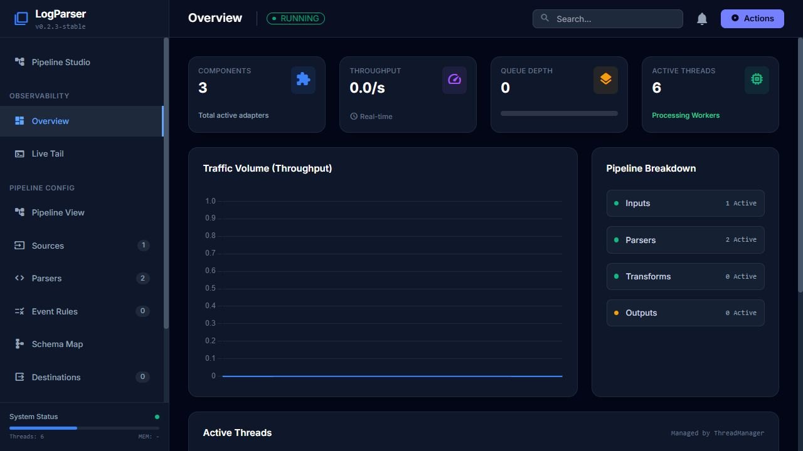

- 장점: 요약 지표, 추이, 처리 구성, 스레드 정보의 위계가 구분된다.
- 문제: Studio의 `Activity`를 눌렀는데 화면 제목과 메뉴는 `Overview`다. 사이드바가 170px에서 270px로 늘어나 본문 시작점이 100px 이동한다.
- 시각 차이: 카드 곡률·여백·배경·주요 버튼 색이 Studio와 다르다. 기존 메뉴는 viewport 높이 안에 모두 들어오지 않아 별도 스크롤이 필요하다.
- 신뢰성: `MEM: -`, 고정 45% 막대, 고정 `System Status: OK`는 실측 데이터와 구별해야 한다.

### 03. Sources — 전체 목록과 현재 파이프라인의 관계가 불명확함

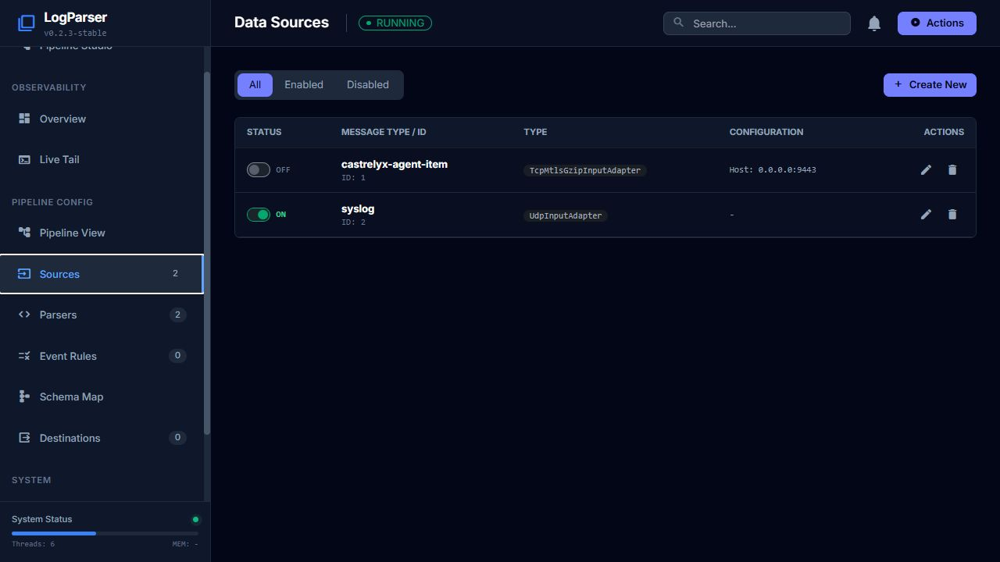

- 장점: 상태, message type, adapter type, 설정 요약을 빠르게 비교할 수 있다.
- 문제: Studio에서 선택했던 message type과 관계없이 전체 목록으로 진입한다. 현재 범위가 전체인지 선택한 파이프라인인지 명시되지 않는다.
- 확인된 불일치: Overview에서는 Sources 배지가 1, 목록 진입 후에는 2다. 전자는 활성 개수, 후자는 전체 목록 길이로 같은 배지를 덮어쓴다.
- 개선: 목록을 없애기보다 전역 구성요소 인벤토리로 남기고, 행의 편집은 해당 message type과 컴포넌트를 선택한 공통 편집기로 연결한다.

### 04. Sources의 동일 Input 편집 — 편집 모델 중복

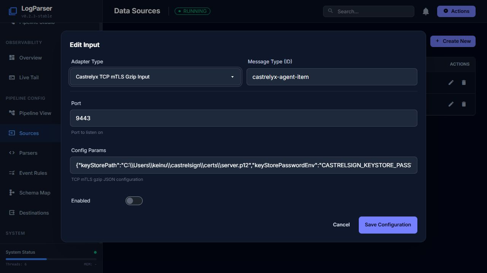

- 장점: 단순한 설정에는 모달의 짧은 경로가 편리하다.
- 문제: 01번과 같은 TCP mTLS Input이 여기서는 `Config Params` 한 줄 JSON 입력으로 표시된다. 긴 값은 잘리고, TLS·용량 설정을 필드별로 검증하거나 이해하기 어렵다.
- 불일치: message type은 Studio에서는 읽기 전용인데 여기서는 직접 편집 가능하다. 타입 명칭, 폼 높이, 저장 버튼 문구도 달라진다.
- 개선: 복잡한 Input/Parser/Transform/Output의 실제 설정 편집은 한 구현을 공유한다. JSON은 고급 보기로 분리한다.

### 05. Schema Map — 작업 대상과 도구 계층이 분리됨

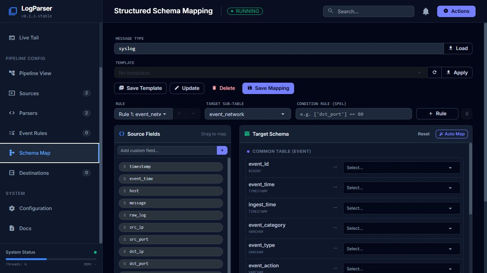

- 장점: Source/Target 비교와 mapping template 재사용 도구가 있다.
- 문제: Studio의 `castrelyx-agent-item` 컨텍스트가 이어지지 않고 `syslog`로 진입했다. message type은 별도 텍스트 입력과 Load 동작으로 관리한다.
- 위계: message type·template·template 관리·rule·target·condition이 여러 줄을 차지해 실제 매핑 영역이 아래로 밀린다. template이 없어도 Apply/Update/Delete가 활성 상태로 보여 다음 동작을 혼동시킨다.
- 개선: 현재 pipeline의 Structured Transform 편집과 동일한 mapping 컴포넌트를 사용한다. 템플릿 기능은 유지하되 보조 메뉴로 묶고, 선택 없음 상태를 버튼 활성 조건에 반영한다.

### 06. Live Tail — 화면은 단순하나 범위와 상태 설명이 부족함

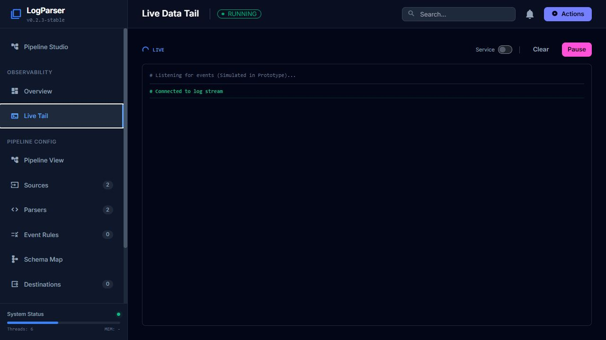

- 장점: 로그 읽기 영역이 넓고 Pause/Clear 동작이 가깝다.
- 문제: Studio의 `Live tail`, 메뉴의 `Live Tail`, 제목의 `Live Data Tail`이 서로 다르다. Studio의 파랑·기존 UI의 보라와 달리 Pause는 강한 분홍색이다.
- 신뢰성: `Simulated in Prototype` 안내와 `Connected to log stream`이 동시에 보인다. 실제 연결인지 데모인지 모호하다.
- 범위: 현재 pipeline 컨텍스트와 연결되는 필터가 보이지 않는다. 상단 Search는 로그 검색처럼 보이지만 코드상 adapter 목록 검색만 수행한다.
- 개선: 연결 중/연결됨/중단/재연결/이벤트 없음 상태를 구분하고, 지원하는 범위의 필터를 명시한다. 실제 이벤트 흐름과 재연결은 별도 검증이 필요하다.

### 07. Pipeline View — Studio와 역할이 겹침

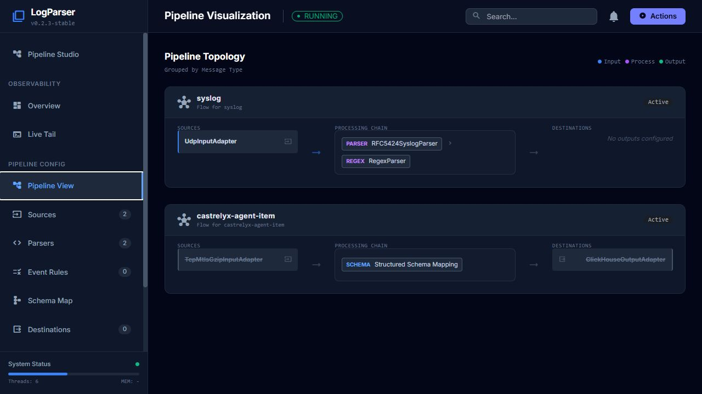

- 장점: 여러 message type의 흐름을 한 번에 비교하기 좋다.
- 문제: 같은 단계의 편집 진입점이 Studio와 별도로 존재하며 이 화면은 기존 모달로 연결된다. 어떤 화면이 설정의 기본 진입점인지 알기 어렵다.
- 상태: 비활성 Input/Output이 취소선으로 표시된 카드에도 `Active`가 보인다. 코드에서 해당 배지는 고정 문자열이다.
- 개선: 전체 pipeline 탐색/요약 역할로 명확히 구분하고, 편집은 Studio로 연결한다. 상태는 실행·구성·검증 상태를 분리해 표시한다.

### 08. Settings — 이름과 저장 안내를 통합해야 함

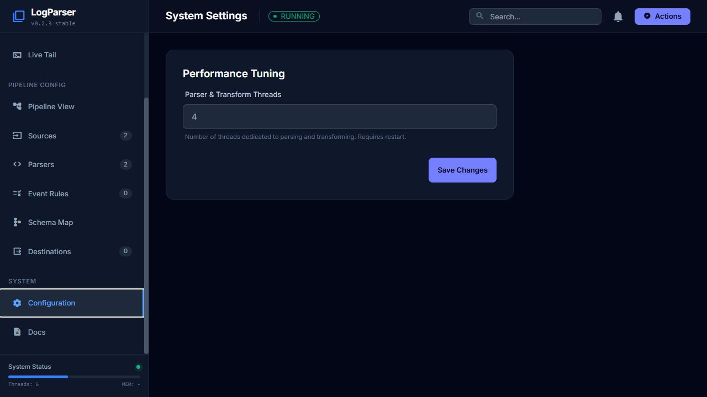

- 장점: 설정 하나를 이해하기 쉬운 카드로 제시한다.
- 문제: `Settings` → `Configuration` → `System Settings`로 명칭이 달라진다. 단일 필드에 다른 화면과 다른 큰 input/button 규격을 사용한다.
- 검증 필요: `Requires restart` 안내와 설정 변경 시 worker count를 갱신하는 이벤트 경로가 있다. 실제 반영 방식에 맞춰 안내를 정리해야 한다.
- 개선: 공통 Settings 명칭, 필드/버튼 규격, 저장 결과 안내를 사용한다. 필드가 적은 화면을 억지로 다중 패널로 만들지는 않는다.

### 09. Docs — 세 번째 디자인 체계와 복귀 경로 문제

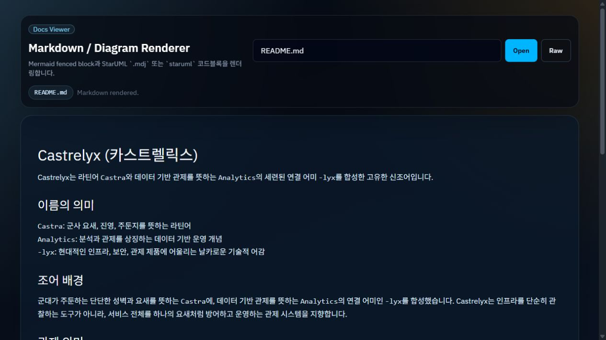

- 장점: 긴 문서 읽기와 Markdown/다이어그램 렌더링 영역은 충분하다.
- 문제: 앱 메뉴가 사라지고 IBM Plex 글꼴·그라데이션·더 큰 곡률의 별도 페이지가 된다. 페이지 안에서 콘솔로 돌아오는 링크가 보이지 않는다.
- 문서 진입: Logparser의 Docs가 현재 실행에서는 제품 사용 설명 대신 저장소 루트의 Castrelyx 소개 README로 연결됐다.
- 복귀: Settings에서 Docs로 이동한 뒤 브라우저 뒤로 가기를 사용했을 때 초기 로딩 후 Studio로 돌아왔다. 이전 화면을 복원하지 않는다.
- 개선: 공통 틀 또는 명확한 콘솔 복귀 링크, Logparser 사용 설명 진입점, URL 기반 view/message type 복원 규칙을 마련한다.

### 10. 390px Studio — 전역 탐색과 주요 동작 접근 불가

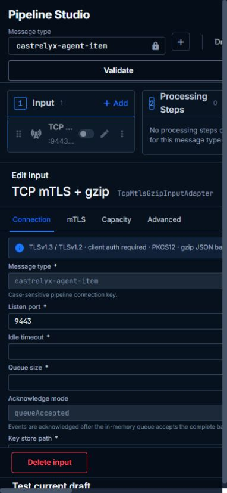

- 확인: 760px 이하 규칙에서 사이드바를 숨기지만 대체 메뉴가 없다. 390px에서는 상단 컨텍스트와 Save/Deploy가 오른쪽으로 밀려 보이지 않는다.
- 위 이미지는 잘못 잘라낸 캡처가 아니라 실제 viewport에서 재현한 화면 넘침이다.
- 개선: 전역 메뉴를 열 수 있는 컨트롤을 유지하고, 헤더와 본문에 `min-width: 0` 및 줄바꿈/재배치 규칙을 적용한다. 상세 폼은 단일 열로, 테스트는 접을 수 있는 하단 영역으로 구성한다.

### 11. Validate 후 — 최초 표시와 실제 검증 결과가 다름

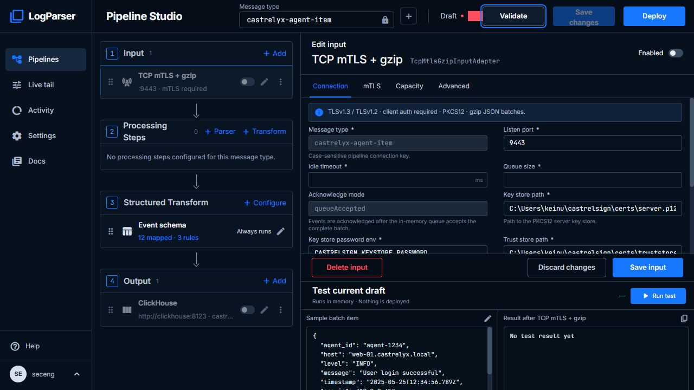

- 설정을 바꾸지 않고 Validate만 누르자 01번의 `Valid`가 DOM상 `Invalid`로 바뀌었다.
- 1280px에서 최초 상태 배지의 오른쪽 경계는 x=904, Validate 버튼 왼쪽 경계는 x=890으로 14px 겹친다. Invalid 표시에서도 상태 텍스트가 버튼에 가려진다.
- 개선: 초기 상태는 미검증으로 표시하거나 실제 검증을 실행한다. 결과와 오류 요약을 지속적으로 볼 수 있어야 한다. 검증 결과 길이가 달라져도 동작 버튼과 충돌하지 않도록 배치한다.

## 4. 우선순위

| 우선순위 | 문제 | 근거 | 권장 조치 |
| --- | --- | --- | --- |
| P1 | 화면 전환 시 전역 UI와 메뉴 구조 변경 | 01–03, 06, 08 | 공통 shell 하나로 통합. 모든 화면에서 동일한 메뉴 이름·순서·선택 상태 유지 |
| P1 | 동일 설정의 두 편집기와 별도 message type 상태 | 01, 03–05, 07 | 목록/토폴로지에서 공통 편집기로 연결. message type 및 선택 컴포넌트를 URL/공유 상태에 보존 |
| P1 | Save·Deploy·Valid·Active의 의미 불일치 | 01, 07, 11 및 저장 이벤트 코드 | 실제 저장/적용 계약을 먼저 정의. 초기 미검증, 실행 상태, 미저장 상태를 별도 표시 |
| P1 | 작은 화면에서 메뉴와 동작 접근 불가, 1280px 헤더 충돌 | 10, 11 | 대체 메뉴·헤더 재배치·컨테이너 최소 폭 수정 |
| P1 | 주요 폼 입력의 접근성 이름 연결 누락 | 01 및 DOM/렌더러 | 공통 field에 id/for, 설명 연결, 오류 연결, focus 처리 추가 |
| P2 | 색·여백·곡률·input/button 크기 불일치 | 01–09 | 공통 토큰과 컴포넌트 규격으로 통합 |
| P2 | 고정/데모 안내와 실제 상태 혼재, 같은 배지의 집계 의미 변경 | 02, 03, 06, 07 | 데이터 없음/미수집/데모 상태를 명시. 집계 기준을 화면 간 고정 |
| P2 | 검색/템플릿/문서 도구의 범위가 모호함 | 05, 06, 09 | 페이지에 맞는 검색과 도구만 노출. 실제 문서 진입점과 복귀 경로 제공 |

P1은 제품 사용 방식·설정 신뢰성·핵심 동작 접근에 영향을 주는 항목이다. P2는 그 다음에 통일할 가독성과 조작 규칙이다.

## 5. 권장 통합 구조

| 영역 | 유지할 역할 | 통합 기준 |
| --- | --- | --- |
| Overview | 전체 실행 상태와 처리 지표 | 현재처럼 요약/차트를 사용하되 공통 shell·카드·상태 규칙 적용 |
| Pipelines | 전체 pipeline 탐색과 개별 Studio 편집 | 목록/흐름 요약 → 특정 message type의 Studio. 동일한 좌측 메뉴 항목 유지 |
| Components | Sources·Parsers·Event Rules·Destinations 전체 인벤토리 | 기존 기능을 삭제하지 않고 묶어 노출. 편집은 Studio의 동일 컴포넌트로 이동 |
| Schema Mapping | mapping 및 template 관리 | Studio와 같은 mapping 구현 공유. 기존 template 생성/적용/수정/삭제 기능 보존 |
| Live Tail | 실제 유입 이벤트 확인 | 전역/선택 pipeline 범위를 명시. 적용 가능한 필터만 제공 |
| Settings | 시스템 설정 | 동일 필드·버튼·상태 메시지 사용 |
| Docs | 제품 사용법과 설정 참조 | 읽기용 본문을 유지하면서 공통 탐색 또는 명시적 복귀 경로 제공 |

Studio의 좁고 작업 중심적인 편집 방식은 유지할 가치가 있다. 다만 현재 170px 사이드바나 10px 설명문까지 전체 제품 표준으로 복제하지는 않는다. 공통 shell에는 모든 메뉴가 안정적으로 들어갈 폭을 정하고, 접힌 상태도 페이지별로 달라지지 않게 한다.

### 공통 시각 규칙

- Studio의 파란 accent를 주요 동작 색으로 삼고, 보라/분홍 primary·secondary 기본값을 제거한다. 성공·경고·오류 색은 상태에만 사용한다.
- 현재 Inter/JetBrains Mono를 공통 글꼴로 유지한다. 문서도 같은 글꼴 계열을 사용하되 읽기 폭과 줄 간격을 별도로 조절한다.
- 배경/표면/경계/본문/보조문자/상태 색을 `--app-*` 의미 토큰으로 정의한다. `--studio-*`는 Studio의 레이아웃 변수만 남기거나 공통 토큰을 참조한다.
- input/button 높이, border radius, focus ring, spacing scale을 공통화한다. 데이터 표·폼·문서의 밀도 차이는 허용하지만 동작 의미와 컨트롤 규격은 일관되게 한다.
- 하단 고정 저장 영역과 펼침 가능한 테스트 영역을 사용해 긴 폼의 가용 공간을 확보한다.

### 저장과 적용 계약

현재 Studio의 상단 `Save changes`와 폼 하단 `Save input`은 모두 선택한 컴포넌트의 저장 동작으로 연결된다. 서버의 저장 이벤트는 adapter 재시작/제거 또는 processing reload로 이어질 수 있으므로, 현재 화면을 순수한 draft 저장 → 별도 Deploy 체계로 설명하면 안 된다.

단기적으로는 **현재 컴포넌트 저장과 런타임 반영 여부를 명시하는 UI**가 맞다. 진짜 별도 배포 단계를 원한다면 draft와 실행 설정 저장소/버전 및 원자적 적용 API가 필요하다. 이 검토만으로 백엔드 계약을 바꾸거나 저장/적용을 실행하지 않았다.

## 6. 구현 근거

라인 번호는 검토 당시 작업 트리 기준이다.

| 원인 | 구현 위치 |
| --- | --- |
| Studio/legacy 메뉴와 두 header 공존 | `src/main/resources/static/index.html:128`, `:164`, `:285`, `:319` |
| Studio 진입 때 body class로 앱 전체 스타일 전환 | `src/main/resources/static/js/app.js:61` |
| 별도 전역 토큰 및 shell override | `src/main/resources/static/css/pipeline-studio.css:1`, `:32`, `:37`, `:70` |
| Studio 3열 header, 16px 버튼 간격, 760px 이하 sidebar 제거 | `src/main/resources/static/css/pipeline-studio.css:177`, `:318`, `:1467` |
| Studio/legacy 저장·폼 구현 분리 | `src/main/resources/static/js/pipeline-studio.js:1253`, `src/main/resources/static/js/app.js:654` |
| 상단 Save가 선택 컴포넌트 저장과 동일 | `src/main/resources/static/js/pipeline-studio.js:315` |
| 입력 label에 for/id 연결 없음 | `src/main/resources/static/js/pipeline-studio.js:749` |
| 초기 valid=true 및 명시적 검증 | `src/main/resources/static/js/pipeline-studio.js:211`, `:1533` |
| 저장 이벤트가 런타임에 전달됨 | `src/main/java/org/keinus/logparser/domain/configuration/service/ConfigManagementService.java:63`, `src/main/java/org/keinus/logparser/application/pipeline/PipelineConfigEventListener.java:20` |
| 동일 배지를 활성 개수/전체 개수로 각각 갱신 | `src/main/resources/static/js/app.js:149`, `:516` |
| 전역 Search가 adapter 목록만 검색 | `src/main/resources/static/js/app.js:635` |
| Pipeline View의 Active 고정 문자열 | `src/main/resources/static/js/app.js:343` |
| 별도 Schema Map 상태와 로드 | `src/main/resources/static/js/app.js:993`, `src/main/resources/static/js/mapper.js:1` |
| Docs의 별도 폰트와 색상 | `src/main/resources/static/markdown-viewer.html:8` |

기존 변경 사항이 있는 작업 트리였다. 해당 수정 사항을 덮어쓰거나 정리하지 않았다.

## 7. 수정 순서와 완료 기준

1. **공통 shell과 명칭 통합**: Studio와 legacy navigation의 이중 구조를 제거하고 단일 menu/header를 사용한다. 화면 전환으로 sidebar 폭이나 메뉴 이름이 바뀌지 않아야 한다.
2. **컨텍스트와 편집 경로 통합**: component 목록 및 Pipeline View의 편집 버튼이 같은 Studio 편집기로 연결되어야 한다. message type, 선택 컴포넌트, 문서에서 돌아올 화면을 복원할 수 있어야 한다. 기존 template 기능과 전역 인벤토리는 보존한다.
3. **저장·검증·실행 상태 정리**: 미검증을 Valid로 표시하지 않는다. 저장의 적용 범위와 시점을 안내한다. 활성 개수/전체 개수를 같은 배지에서 혼용하지 않는다.
4. **공통 컨트롤과 접근성 적용**: label/설명/오류 연결, 의미 있는 icon button 이름, keyboard focus와 토글 상태를 확인한다. 대비와 전체 키보드/스크린리더 검사는 별도 수행한다.
5. **반응형 회귀 확인**: 390/768/1024/1280/1440px에서 menu·message type·주요 동작 접근성을 확인한다. 1280px 상태 배지와 Validate의 충돌이 없어야 한다.

## 8. 검증 결과와 한계

- 11개 화면/상태 JPEG를 저장하고 확인했다. 전체 이미지와 이 문서는 `readme/ui-audit-2026-08-27/` 및 `readme/ui-audit-2026-08-27.md`에 있다.
- 기존 JavaScript 테스트는 `node --test src/test/js/pipeline-studio.test.cjs src/test/js/live-tail.test.cjs`로 실행해 **33개 모두 통과**했다. 이 결과가 시각적 일관성이나 전체 접근성 검증을 대신하지는 않는다.
- 기본 UI CSS와 브라우저 DOM에서 일관성 문제를 확인했다. 화면 캡처만으로 전체 접근성 적합성이나 실제 배포 안정성을 보장하지 않는다.
- 기존 테스트를 `.\gradlew test`로 실행했다. **446개 중 1개 실패**: `ProcessingStepServiceTest.executesParserAndTransformInOnePriorityOrderedChain`, `ProcessingStepServiceTest.java:51`, expected `hello`, actual `null`.
- 이번 검토는 제품 코드를 변경하지 않았으며, 위 실패는 현재 작업 트리의 테스트 결과다. 실패 원인 분석/수정은 이번 UI 검토 범위 밖이다.
- 저장/배포, 장애 시 상태 변화, 모든 adapter 타입, 실제 이벤트 유입, 전체 키보드·스크린리더 경로는 검증하지 않았다.
