# Castrelyx 21번 서버 운영 화면 매뉴얼

이 문서는 2026-07-13 23:23~23:30 KST에 `https://192.168.50.21/`의 실제 관리자 화면을 직접 조작하고 캡처해 작성한 운영 매뉴얼이다. 화면의 수치와 이벤트는 캡처 시점의 운영 데이터이므로 이후 달라질 수 있다.

## 1. 접속 정보와 확인 범위

| 항목 | 값 |
|---|---|
| Manager URL | `https://192.168.50.21/` |
| 대상 호스트 | `x86host` (`192.168.50.21`) |
| 캡처 권한 | `ADMIN` |
| 캡처 범위 | 좌측 메뉴 10개, 자산 상세 7개 탭, 주요 대화상자와 필터 동작 |
| 호스트 점검 | `castrelyx-agent` active, `NRestarts=0` |
| 리스너 점검 | `443`, `8443`, `8765`, `9443` LISTEN |

브라우저에서 자체 서명 인증서 경고가 나타날 수 있다. 인증서 지문과 접속 대상이 21번 서버인지 확인한 뒤 조직의 보안 절차에 따라 접속한다. 계정과 비밀번호는 이 문서나 캡처 파일에 기록하지 않는다.

캡처 당시에는 이미 인증된 관리자 세션을 사용했기 때문에 로그인 폼은 포함하지 않았다. 로그인 후에는 좌측 메뉴에서 화면을 전환하고, 좌측 하단의 `로그아웃`으로 세션을 종료한다.

## 2. 화면 빠른 찾기

| 메뉴 | 주요 용도 | 캡처 |
|---|---|---|
| Operations | 대응 우선순위와 자산 인스펙터 | [01-operations.png](screenshots/01-operations.png) |
| Incidents | 알림 필터와 조치 | [02-incidents.png](screenshots/02-incidents.png) |
| Network | 자산·인터페이스별 트래픽 | [03-network.png](screenshots/03-network.png) |
| Assets | 자산 목록, 상세, 추가 | [04-assets.png](screenshots/04-assets.png) |
| Hunt | 수집 로그 검색 | [05-hunt.png](screenshots/05-hunt.png) |
| Collection | Agent 상태와 공격 표면 | [06-collection.png](screenshots/06-collection.png) |
| SNMP | SNMP poll/interface 영역 | [07-snmp.png](screenshots/07-snmp.png) |
| CastrelSign | Agent 등록·인증서·업데이트 | [08-castrelsign.png](screenshots/08-castrelsign.png) |
| LogParser | 외부 LogParser UI 열기 | [09-logparser.png](screenshots/09-logparser.png) |
| Settings | 사용자·향후 연동 안내 | [10-settings.png](screenshots/10-settings.png) |

## 3. Operations

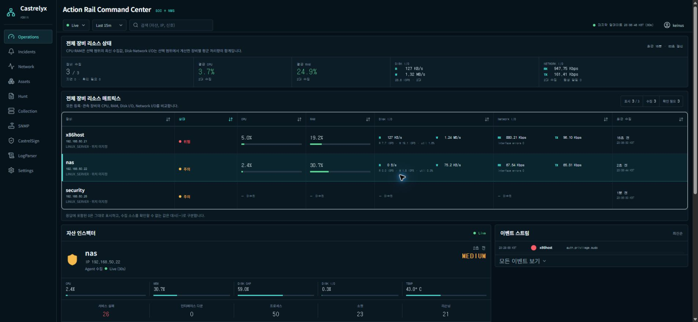

Operations는 로그인 후 우선 확인할 통합 상황판이다.

1. `시간 범위`에서 15분, 1시간, 24시간 중 조사 범위를 선택한다.
2. `자산, IP, 신호 검색`으로 조사 대상을 좁힌다.
3. `대응 우선순위`의 위험도 필터와 정렬을 사용해 처리 순서를 정한다.
4. 우선순위 목록에서 자산을 선택하면 우측 `자산 인스펙터`가 갱신된다.
5. CPU, 메모리, 디스크, 온도, 서비스 실패, 인터페이스, 프로세스와 소켓을 함께 확인한다.
6. `조사`로 상세 분석을 시작하고, 담당자와 상태가 확정된 경우에만 `확인/할당`을 사용한다.

캡처 시점에는 자산 3개와 활성 신호 3개가 표시됐다. `security` 자산은 `HIGH`이고 수집이 지연된 상태였다. 아래쪽의 네트워크 인터페이스 비교, 이벤트 스트림, 수집 커버리지는 30초 단위 갱신 상태를 함께 판단할 때 사용한다.

## 4. Incidents

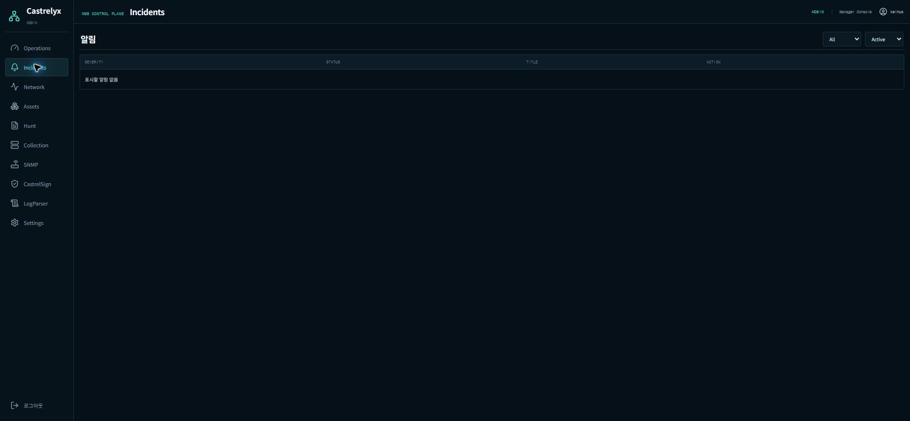

`severity`와 `status` 필터를 조합해 처리할 알림만 남긴다. 일반적인 처리 순서는 `Active` 확인, 원인 조사, 담당자 확인, acknowledge, 해결 후 resolve다. 캡처 당시에는 표시할 활성 알림이 없었다.

알림이 없다고 해서 수집 장애가 없다는 뜻은 아니다. Operations의 수집 지연, Collection의 Agent 상태, 자산 상세의 최근 관측 시각을 함께 확인한다.

## 5. Network

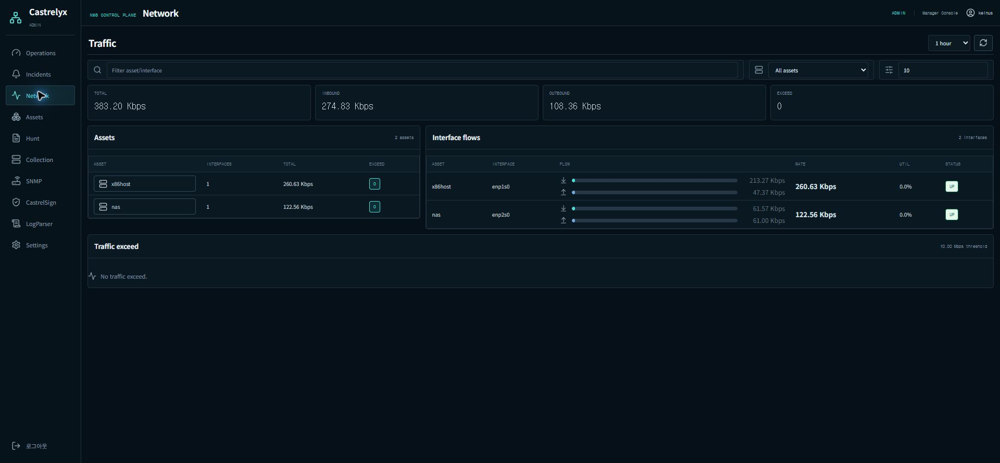

Network는 인터페이스별 RX/TX와 임계값 초과를 비교한다.

- `Range`: 15분~24시간 범위를 선택한다.
- `Filter asset/interface`: 자산명 또는 인터페이스명을 검색한다.
- `Asset`: 특정 자산만 필터링한다.
- `Exceed threshold Mbps`: 초과 판정 기준을 지정한다.
- `Refresh traffic`: 최신 값을 다시 조회한다.

상단의 Total, Inbound, Outbound, Exceed를 먼저 보고, 아래 Assets와 Interface flows에서 원인 자산과 인터페이스를 찾는다. 자산 이름을 누르면 해당 자산만 즉시 필터링된다.

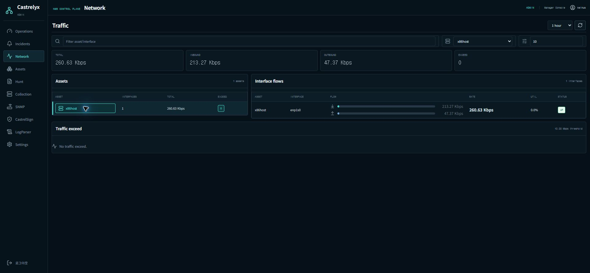

캡처 당시 전체 트래픽은 약 `153.02 Kbps`, `nas` 단독은 약 `121.52 Kbps`였고 10 Mbps 초과 항목은 없었다. 이 값은 실시간으로 변한다.

## 6. Assets

### 6.1 자산 목록

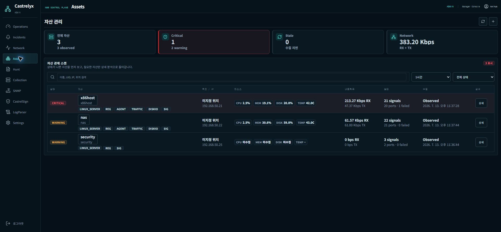

자산 목록은 상태가 나쁜 자산부터 확인하도록 구성되어 있다. 검색, 조회 범위, 상태 필터를 사용한 뒤 다음 항목을 한 행에서 비교한다.

- 상태와 자산 유형
- 위치와 관리 IP
- CPU, 메모리, 디스크, 온도
- RX/TX
- 신호 수, 열린 포트, 실패 서비스
- 마지막 수집 상태와 시각

캡처 당시 `nas`, `x86host`, `security` 3개 자산이 모두 WARNING으로 표시됐다. `security`는 CPU, 메모리, 디스크가 미수집 상태였으므로 최근 관측 시각과 Agent 상태를 추가 확인해야 한다.

### 6.2 자산 상세 - 성능

자산명 또는 `상세`를 눌러 들어간다. 예시는 `x86host`다.

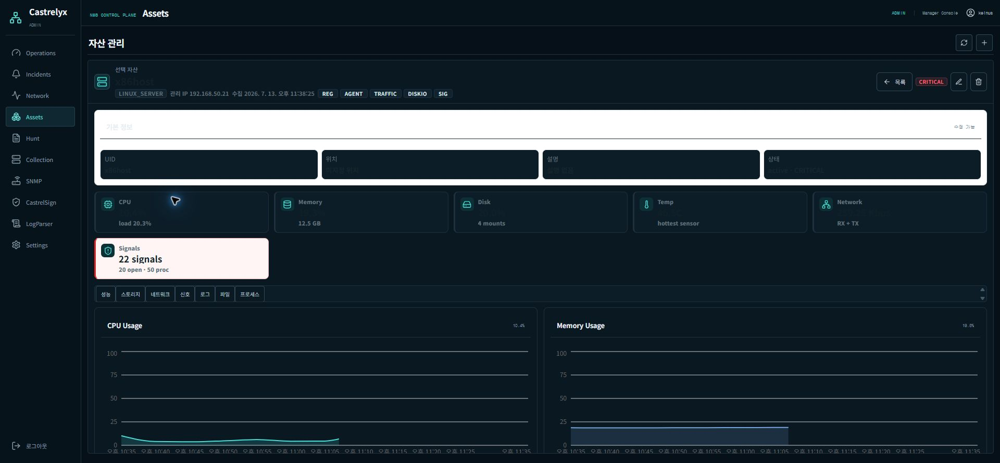

상단에는 UID, 위치, 설명, 상태와 핵심 자원 요약이 표시된다. `성능` 탭은 CPU, 메모리, 온도, RX/TX의 시간 추이를 확인한다. 우측 상단의 수정·삭제는 실제 자산 데이터가 변경되므로 대상 UID와 IP를 다시 확인한 뒤 실행한다.

### 6.3 자산 상세 - 스토리지

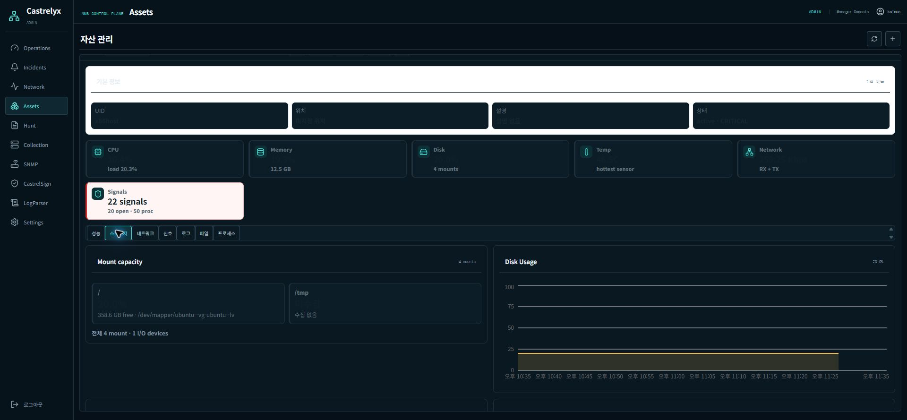

Mount capacity, Disk Usage, Disk I/O, I/O device, mount별 사용률을 확인한다. 단순 사용률뿐 아니라 read/write 처리량, IOPS와 I/O time을 함께 봐야 병목을 구분할 수 있다.

### 6.4 자산 상세 - 네트워크

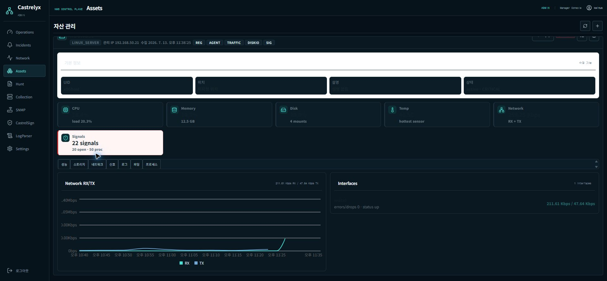

자산 단위 RX/TX 추이와 인터페이스 상태, errors/drops를 확인한다. 전체 Network 화면의 합계와 이 탭의 자산 단위 값을 교차 확인한다.

### 6.5 자산 상세 - 신호

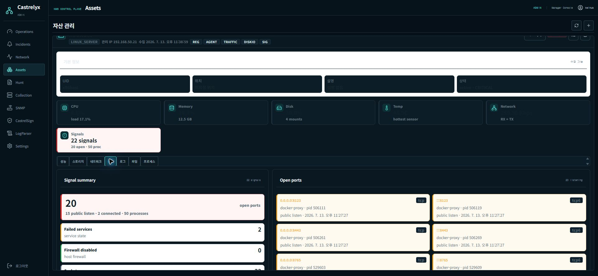

열린 포트, 공인/로컬 listen 구분, 실패 서비스, 방화벽 상태, 프로세스-소켓 연결 관계를 확인한다. 외부 노출 주소가 보이면 서비스 소유자와 필요 포트인지 확인하고, 불필요한 노출은 방화벽 또는 서비스 설정 변경 대상으로 등록한다.

### 6.6 자산 상세 - 로그

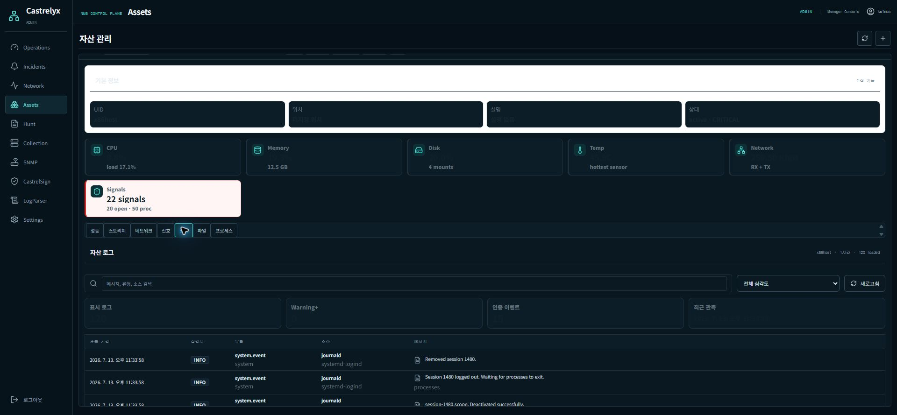

검색어와 심각도 필터로 해당 자산의 로그만 조사한다. 표의 시각, severity, type, source, message를 함께 사용한다. 인증·sudo·SSH 로그에는 내부 사용자명, 접속 IP, 공개키 지문 등 운영 정보가 포함될 수 있으므로 캡처를 외부에 공유하지 않는다.

### 6.7 자산 상세 - 파일

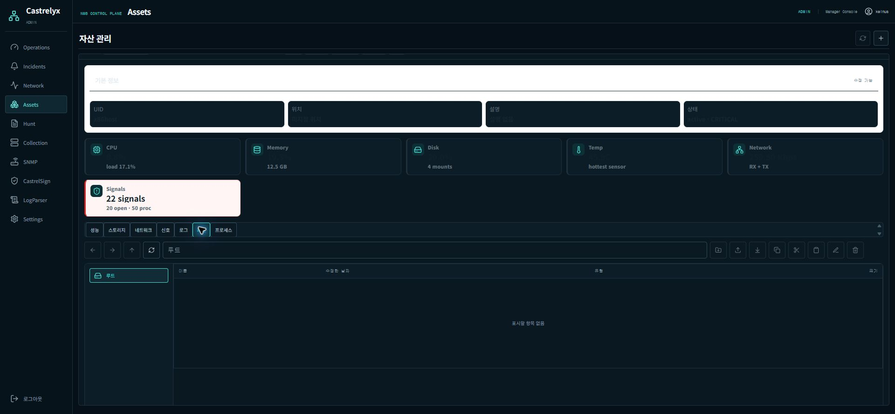

정상 상태에서는 경로 이동, 새 폴더, 업로드, 다운로드, 복사, 이동, 이름 변경, 삭제를 수행한다. 변경 전에 대상 경로와 선택 항목을 확인한다.

캡처 시점의 21번 서버에서는 `503 : upstream service unavailable`가 표시되고 변경 버튼이 비활성화됐다. 이 상태에서는 파일 작업을 시도하지 말고 Manager의 file-manager upstream, Agent remote task 연결, 해당 자산의 Agent 버전을 점검한다.

### 6.8 자산 상세 - 프로세스

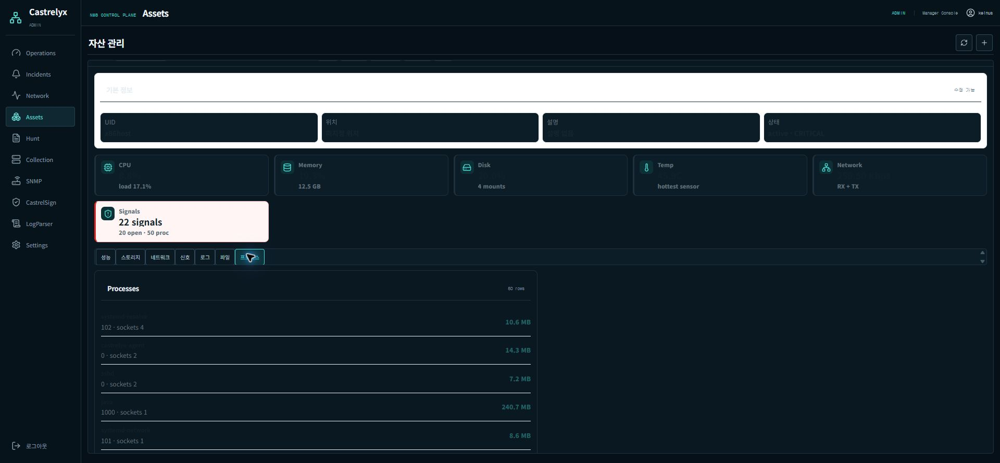

프로세스명, UID, 소켓 수, 메모리 사용량과 프로세스-소켓 맵을 확인한다. 메모리 상위 프로세스와 외부 listen 소켓을 함께 보면 자원 문제와 노출 문제를 한 번에 좁힐 수 있다.

### 6.9 자산 추가

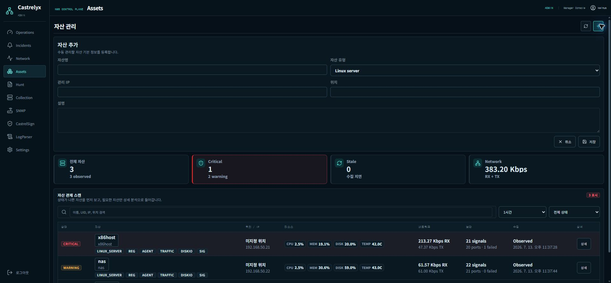

`자산 추가`에서 자산명, 유형, 관리 IP, 위치, 설명을 입력한다. 저장 전 동일 IP 또는 동일 UID의 기존 자산이 없는지 검색한다. 이 매뉴얼 작성 중에는 대화상자 동작만 확인했고 실제 자산은 생성하지 않았다.

## 7. Hunt

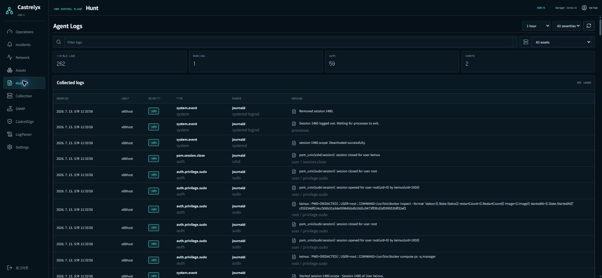

Hunt는 여러 Agent에서 수집된 로그를 한 화면에서 검색한다.

1. `Log range`에서 시간 범위를 정한다.
2. `Log severity`와 `Log asset`으로 대상을 좁힌다.
3. `Filter agent logs`에 메시지, 유형 또는 소스 검색어를 입력한다.
4. Warning+와 Auth 카운트를 먼저 보고 관련 행의 시각 순서를 확인한다.

캡처 당시 1시간 범위에서 61개 로그, Warning+ 0개, 인증 관련 17개, 자산 2개가 표시됐다. 로그 캡처는 민감한 운영 정보를 포함할 수 있으므로 공유 범위를 제한한다.

## 8. Collection

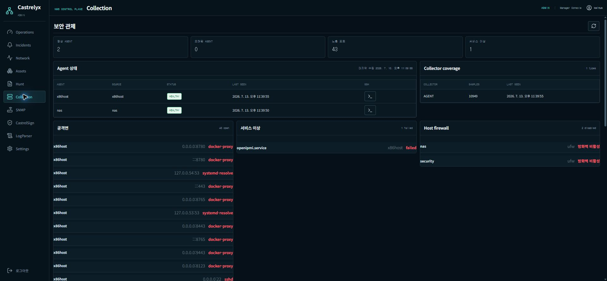

Collection은 Agent와 보안 수집 경로의 상태를 확인한다.

- 정상/오래된 Agent와 마지막 수집 시각
- Collector coverage와 샘플 수
- 열린 포트 기반 공격 표면
- 실패 서비스
- Host firewall 비활성 상태
- 최신 resource telemetry

캡처 당시 `x86host`와 `nas` Agent는 HEALTHY였고, 열린 포트 36개와 실패 서비스 2개가 표시됐다. `Agent 정보 새로고침` 후 마지막 수집 시각이 움직이는지 확인해야 한다.

각 Agent 행의 SSH 버튼은 브라우저 터미널 세션을 연다. 캡처 시점에는 `x86host`에서 세션 생성에 실패했다.

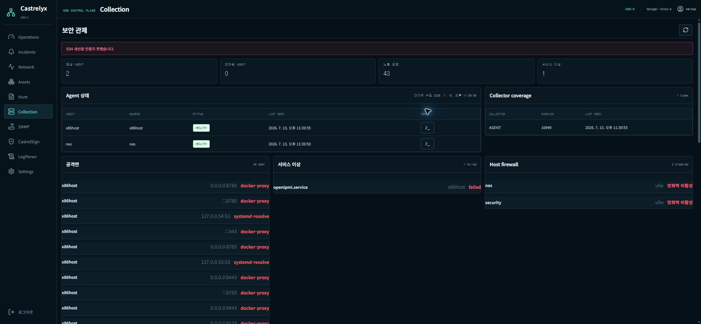

실패 시 Agent가 HEALTHY라는 표시만으로 원격 작업이 정상이라고 판단하지 않는다. Manager 원격 접근 설정, Agent remote-task 지원 여부, 인증 정보, Manager에서 Agent로 가는 연결 경로를 별도로 점검한다.

## 9. SNMP

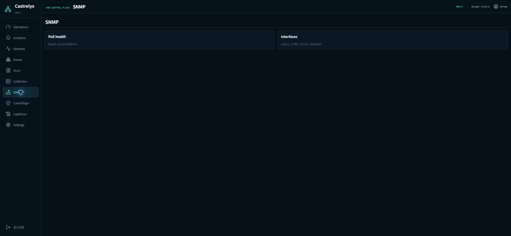

현재 화면에는 `Poll health`와 `Interfaces` 영역의 안내만 표시되고 실제 target 또는 interface 데이터는 없다. SNMP 대상 등록과 polling이 구성된 뒤 성공/실패 수, 상태, 트래픽, 오류, discard를 확인한다.

## 10. CastrelSign

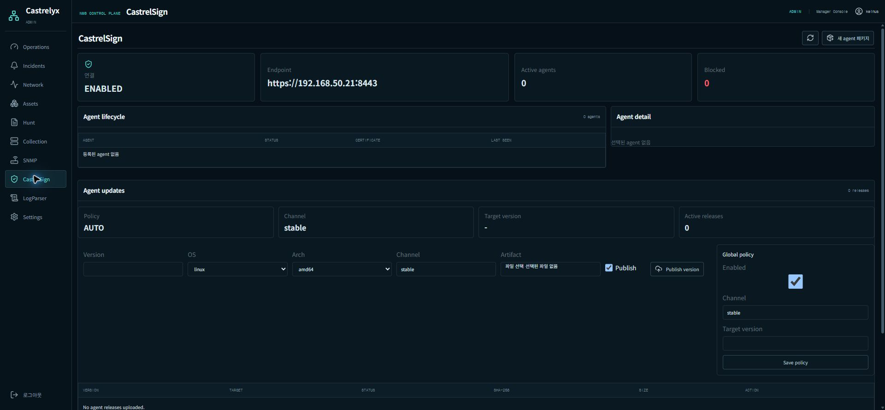

CastrelSign은 Agent lifecycle, enrollment token, 인증서, Agent release, 전역 업데이트 정책과 감사 이력을 관리한다. 캡처 당시 연결은 ENABLED이고 endpoint는 `https://192.168.50.21:8443`, 등록 Agent와 release는 각각 0개였다.

Agent release를 올릴 때는 Version, OS, Arch, Channel, Artifact, Publish 여부를 확인한다. `Save policy`, release publish, token 폐기, Agent 차단/재활성화는 실제 운영 상태를 변경한다.

### 10.1 새 Agent 패키지

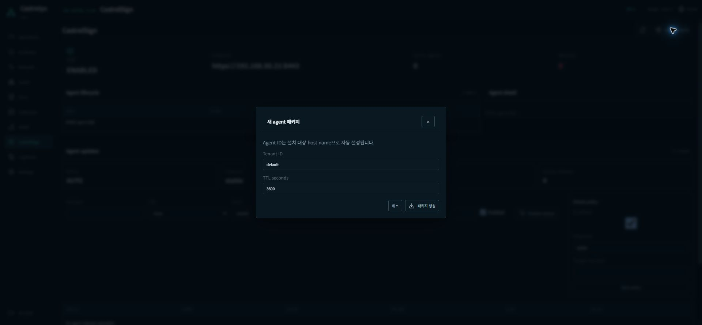

`새 agent 패키지`를 누르면 Tenant ID와 TTL을 지정할 수 있다. Agent ID를 지정하지 않으면 설치 대상 hostname으로 자동 설정된다. `패키지 생성`은 일회성 enrollment package와 token을 실제로 만들고 ZIP 다운로드를 시작하므로 설치 대상과 TTL이 확정된 경우에만 실행한다. 생성된 패키지와 token은 문서나 메신저에 그대로 남기지 않는다.

## 11. LogParser

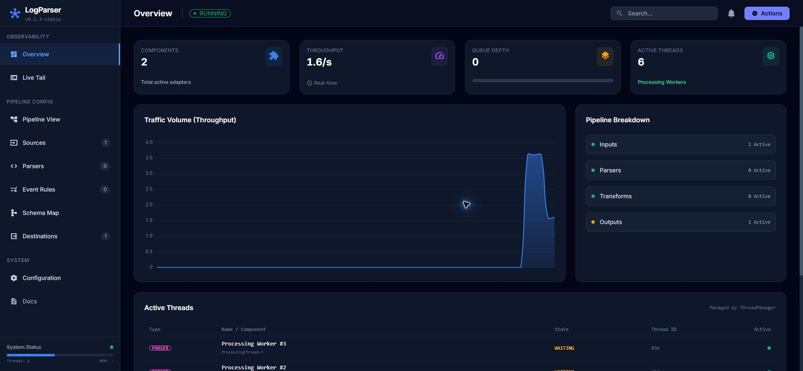

좌측 `LogParser`는 Manager 내부 화면이 아니라 새 탭의 `http://192.168.50.21:8765/`를 연다. 캡처 시점에는 새 탭이 빈 화면으로 표시됐다.

동시에 실제 서버에서는 8765 포트가 LISTEN이고 HTTP GET은 `200`과 약 40 KB 응답을 반환했다. 따라서 빈 화면만으로 서비스를 down으로 판단하지 말고 다음을 구분해서 확인한다.

1. 브라우저의 렌더링/스크립트 문제
2. LogParser UI의 API 또는 정적 자산 호출 실패
3. Manager deep-link가 올바른 URL을 반환하는지
4. LogParser pipeline과 9443 ingest가 실제로 동작하는지

## 12. Settings

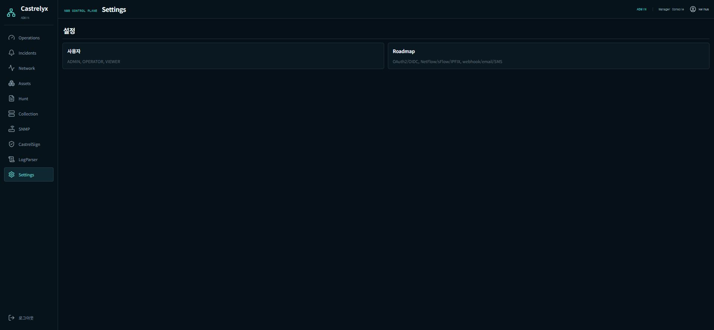

현재 Settings는 사용자 역할(`ADMIN`, `OPERATOR`, `VIEWER`)과 향후 OAuth2/OIDC, NetFlow/sFlow/IPFIX, webhook/email/SMS 계획을 안내한다. 화면에서 직접 변경할 수 있는 설정 항목은 아직 없다.

## 13. 일일 운영 점검 순서

1. Operations에서 활성 신호, 수집 지연, 자산별 최근 시각을 확인한다.
2. Incidents에서 Active와 Critical/Warning을 확인한다.
3. Collection에서 Agent 상태와 Collector sample의 최근 시각을 확인한다.
4. Network에서 RX/TX 급증과 임계값 초과를 확인한다.
5. Assets에서 WARNING/미수집 자산을 열어 성능, 신호, 로그를 교차 확인한다.
6. 필요할 때 Hunt로 여러 Agent 로그를 시간순으로 조사한다.
7. SNMP, CastrelSign, LogParser는 각각 데이터 유무와 연결 상태를 별도로 확인한다.

## 14. 캡처 시점의 확인된 제약

| 항목 | 실제 확인 결과 | 운영 판단 |
|---|---|---|
| 자산 파일 관리자 | `503 upstream service unavailable` | 현재 파일 작업 불가 |
| WebSSH | `SSH 세션을 만들지 못했습니다.` | Agent HEALTHY와 별개로 원격 접근 경로 점검 필요 |
| LogParser UI | 새 탭이 빈 화면 | 8765 HTTP 200이므로 서비스/렌더링/파이프라인을 분리 점검 |
| SNMP | 실제 데이터 없음 | target과 polling 구성 상태 확인 필요 |
| CastrelSign | 등록 Agent/release 0 | Agent lifecycle과 release 배포 전 상태 |
| 권한 상승 | SSH의 `sudo -n`은 비밀번호 필요 | 무인 privileged 작업 불가 |

이 문서의 캡처는 실제 내부 IP, 자산명, 프로세스, 포트와 로그 정보를 포함한다. 저장소 외부로 배포할 때는 보안 검토와 필요한 비식별화를 먼저 수행한다.
