# Castrelyx 21번 서버 운영 화면 매뉴얼

이 문서는 21번 서버의 실제 배포 화면을 직접 조작해 작성한 운영 매뉴얼이다. 기본 화면은 2026-07-13 23:37~23:44 KST, 추가 상태 화면은 2026-07-14 08:08~08:13 KST에 다시 캡처했다. 수치, 이벤트, 마지막 수집 시각은 실시간 운영 데이터이므로 문서의 이미지와 현재 화면이 다를 수 있다.

## 1. 접속 정보와 확인 범위

| 항목 | 값 |
|---|---|
| Manager | `https://192.168.50.21/` |
| LogParser | `http://192.168.50.21:8765/` |
| CastrelSign endpoint | `https://192.168.50.21:8443` |
| Agent ingest | TCP mTLS `9443` |
| 캡처 권한 | `ADMIN` |
| 캡처 범위 | 로그인, Manager 메뉴 10개, 자산 상세 7개 탭, 주요 편집·생성 상태, LogParser 전체 메뉴와 구성 대화상자 |
| 캡처 수 | 42장 |

브라우저에서 자체 서명 인증서 경고가 나타날 수 있다. 인증서 지문과 접속 대상이 21번 서버인지 확인한 뒤 조직의 보안 절차에 따라 접속한다. 계정과 비밀번호는 이 문서와 이미지에 기록하지 않는다.

## 2. 로그인과 화면 공통 구조

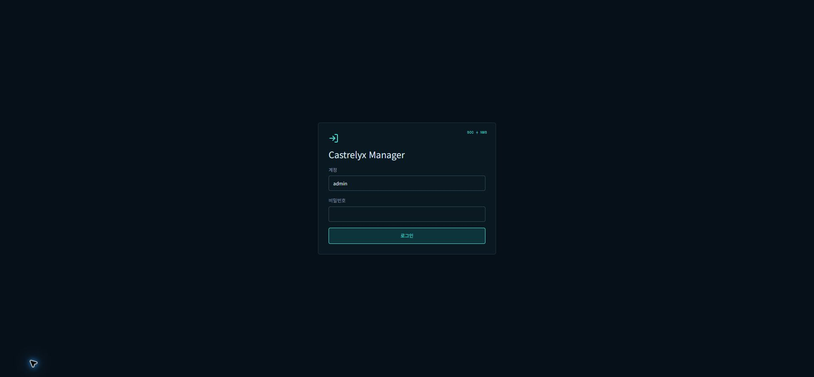

1. `https://192.168.50.21/`에 접속한다.
2. `계정`과 `비밀번호`를 입력한다.
3. `로그인`을 누른다.
4. 로그인 후 좌측 메뉴로 화면을 전환한다.
5. 작업이 끝나면 좌측 하단 `로그아웃`으로 세션을 종료한다.

캡처를 위해 로그아웃한 뒤 다시 로그인했으며, 비밀번호가 입력된 상태의 화면은 저장하지 않았다.

## 3. 화면 빠른 찾기

| 화면 | 용도 | 대표 캡처 |
|---|---|---|
| Operations | 전체 장비 자원 상태, 우선 대응 자산, 인스펙터 | [01-operations.png](screenshots/01-operations.png) |
| Incidents | 알림 필터와 처리 | [02-incidents.png](screenshots/02-incidents.png) |
| Network | 자산·인터페이스별 RX/TX | [03-network.png](screenshots/03-network.png) |
| Assets | 자산 목록, 상세 7개 탭, 추가·수정 | [04-assets.png](screenshots/04-assets.png) |
| Hunt | Agent 로그 검색 | [05-hunt.png](screenshots/05-hunt.png) |
| Collection | Agent, 공격 표면, 수집 지표, WebSSH | [06-collection.png](screenshots/06-collection.png) |
| SNMP | Poll과 인터페이스 상태 | [07-snmp.png](screenshots/07-snmp.png) |
| CastrelSign | Agent 등록, 인증서, release, 업데이트 정책 | [08-castrelsign.png](screenshots/08-castrelsign.png) |
| LogParser | 파이프라인 관찰과 구성 | [09-logparser.png](screenshots/09-logparser.png) |
| Settings | 역할과 향후 연동 안내 | [10-settings.png](screenshots/10-settings.png) |

## 4. Operations

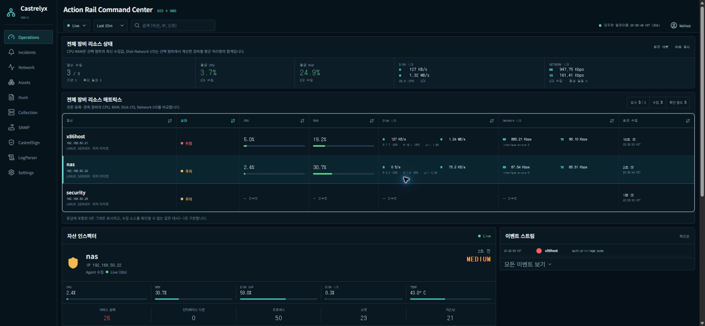

Operations는 로그인 후 가장 먼저 확인하는 통합 상황판이다.

- `시간 범위`: 15분, 1시간, 24시간 중 조사 범위를 선택한다.
- `자산, IP, 신호 검색`: 특정 장비나 신호로 범위를 좁힌다.
- `전체 장비 리소스 상태`: 수집 장비 수, 평균 CPU·RAM, Disk I/O, Network I/O를 한 번에 확인한다.
- `전체 장비 리소스 매트릭스`: 모든 등록 장비의 CPU, RAM, Disk I/O, Network I/O, 최근 수집 시각을 비교한다.
- 장비 행을 선택하면 우측 `자산 인스펙터`가 갱신된다.

수치가 `0`이면 실제 수집된 0이고, 대시(`—`)는 미수집이다. `security`처럼 수집 지연 표시가 있는 장비는 평균값만 보고 정상으로 판단하지 말고 최근 수집 시각을 확인한다.

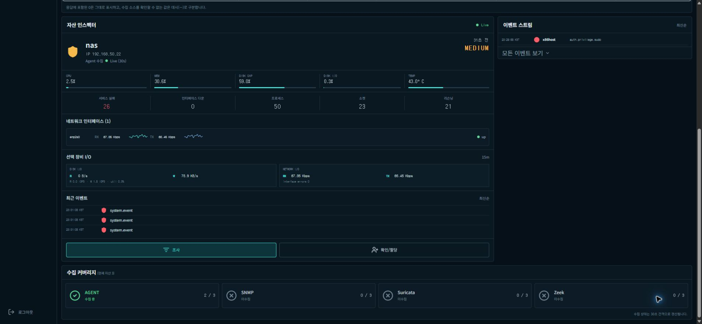

하단에서는 선택 장비의 인터페이스와 I/O, 최근 이벤트, 전체 이벤트 스트림, 수집 커버리지를 확인한다. `조사`는 상세 분석으로 이동하고, `확인/할당`은 운영 처리 상태에 영향을 줄 수 있으므로 담당자와 대상 신호를 확인한 뒤 사용한다.

## 5. Incidents

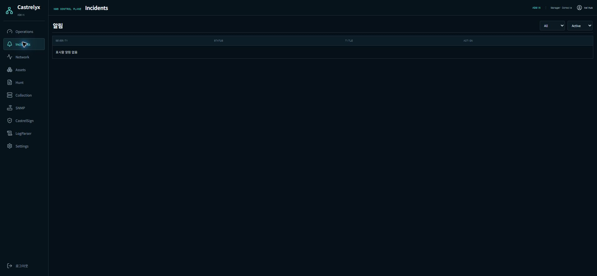

`severity`와 `status`를 조합해 처리할 알림만 남긴다. 일반 순서는 Active 확인, 원인 조사, 담당자 지정, acknowledge, 해결 후 resolve다. 캡처 당시 표시할 활성 알림은 없었다.

알림이 없더라도 수집 장애가 없다는 뜻은 아니다. Operations의 최근 수집, Collection의 Agent 상태, Assets의 관측 시각을 함께 확인한다.

## 6. Network

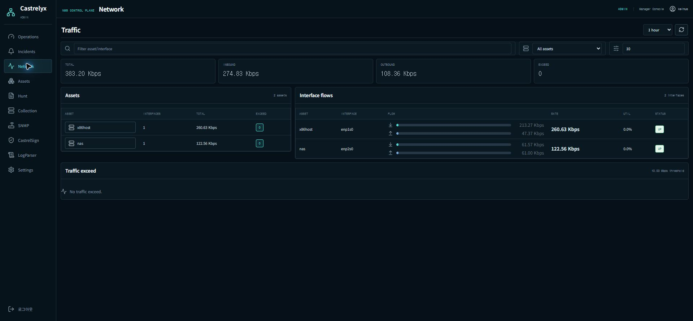

- `Range`: 조회 시간 범위를 선택한다.
- `Filter asset/interface`: 자산명 또는 인터페이스명을 검색한다.
- `Asset`: 특정 자산만 표시한다.
- `Exceed threshold Mbps`: 임계값 초과 판정 기준을 지정한다.
- `Refresh traffic`: 최신 값을 다시 조회한다.

상단 Total, Inbound, Outbound, Exceed를 먼저 보고 아래 Assets와 Interface flows에서 원인 장비와 인터페이스를 찾는다.

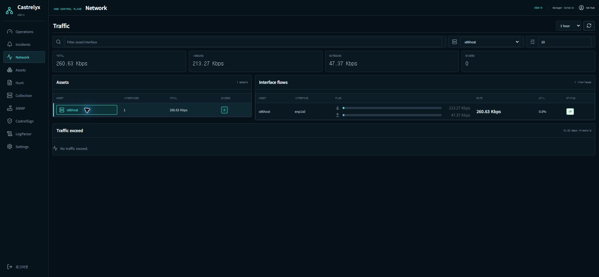

자산 이름을 선택하면 해당 장비만 즉시 필터링된다. 캡처 값은 실시간으로 변하므로 사고 기록에는 조사 시각과 조회 범위를 함께 남긴다.

## 7. Assets

### 7.1 자산 목록

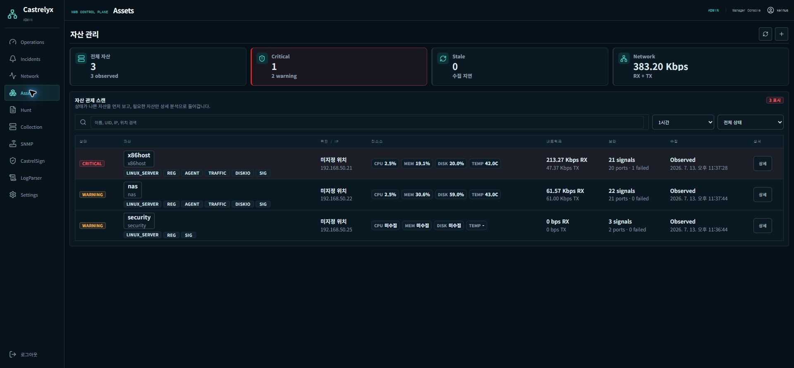

검색, 조회 범위, 상태 필터를 사용해 다음 정보를 한 행에서 비교한다.

- 상태와 자산 유형
- 위치와 관리 IP
- CPU, 메모리, 디스크, 온도
- RX/TX
- 신호, 열린 포트, 실패 서비스
- 마지막 수집 상태와 시각

캡처 당시 `x86host`, `nas`, `security`가 표시됐으며 `security`는 자원값이 미수집 상태였다. 상태 배지보다 최근 수집 시각과 실제 지표 존재 여부를 우선 확인한다.

### 7.2 자산 상세 - 성능

자산명 또는 `상세`를 눌러 들어간다. 아래 예시는 `x86host`다.

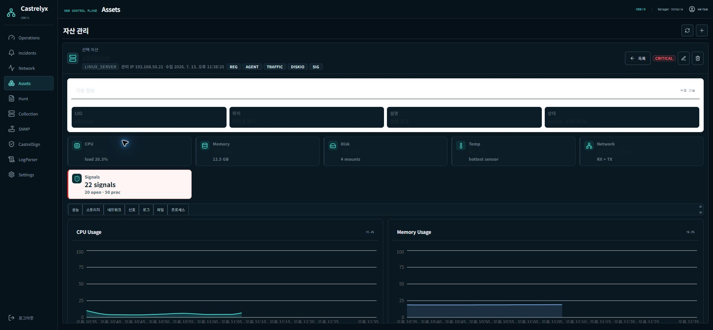

상단 요약에서 UID, 관리 IP, 상태, CPU, 메모리, 디스크, 온도, 네트워크, 신호를 확인한다. `성능` 탭은 CPU, 메모리, 온도, RX/TX의 시간 추이를 표시한다.

### 7.3 자산 상세 - 스토리지

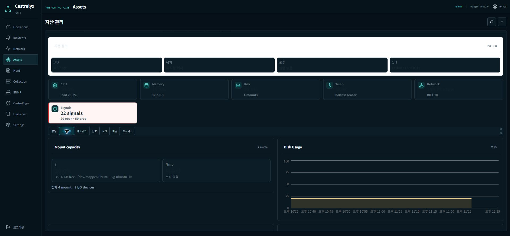

Mount capacity, Disk Usage, Disk I/O, I/O device, mount별 사용률을 확인한다. 사용률뿐 아니라 read/write 처리량, IOPS, I/O time을 함께 봐야 용량 부족과 I/O 병목을 구분할 수 있다.

### 7.4 자산 상세 - 네트워크

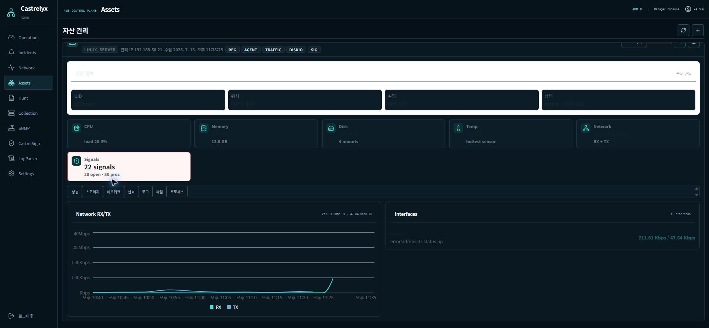

자산 단위 RX/TX 추이, 인터페이스 up/down, errors, drops를 확인한다. 전체 Network 화면의 합계와 이 탭의 자산 단위 값을 교차 확인한다.

### 7.5 자산 상세 - 신호

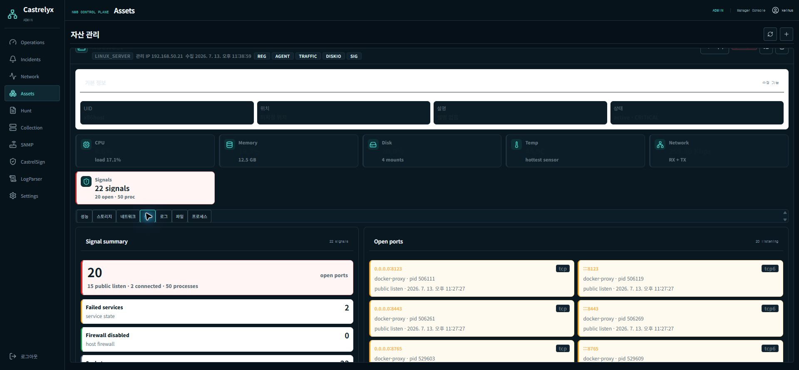

열린 포트, public/local listen 구분, 실패 서비스, 방화벽 상태, 프로세스-소켓 관계를 확인한다. 외부 노출 주소가 보이면 서비스 소유자와 필요 포트인지 확인한다.

### 7.6 자산 상세 - 로그

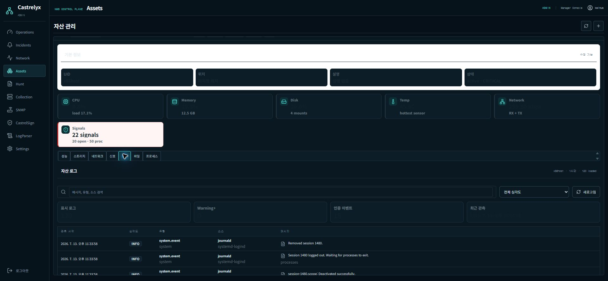

검색어와 심각도 필터로 해당 장비의 로그를 조사한다. 시각, severity, type, source, message를 함께 사용한다. 인증·SSH·sudo 로그에는 내부 운영 정보가 포함될 수 있으므로 캡처 공유 범위를 제한한다.

### 7.7 자산 상세 - 파일

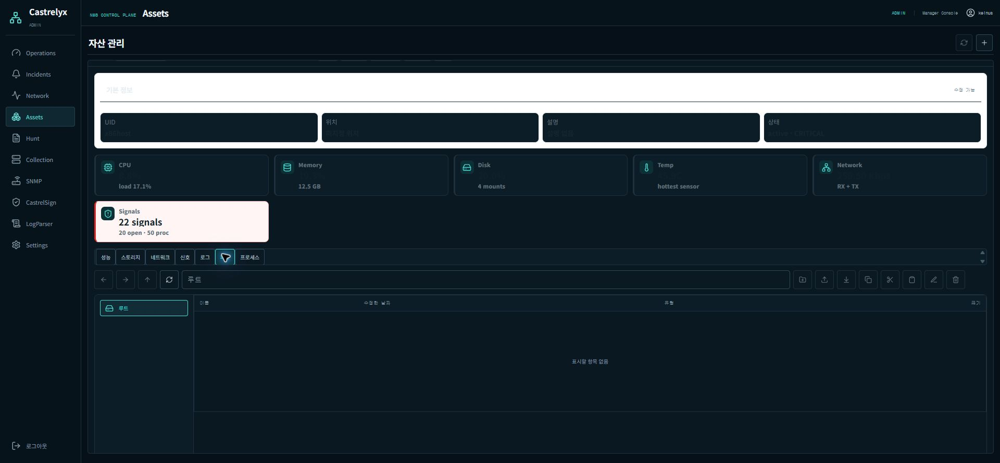

정상 상태에서는 경로 이동, 새 폴더, 업로드, 다운로드, 복사, 이동, 이름 변경, 삭제를 수행한다. 캡처 시점에는 `503 : upstream service unavailable`가 표시되고 작업 버튼이 비활성화됐다. 이 상태에서는 파일 작업을 시도하지 말고 file-manager upstream과 Agent remote-task 경로를 점검한다.

### 7.8 자산 상세 - 프로세스

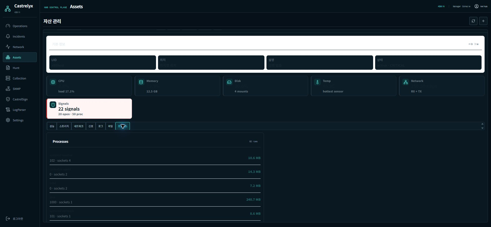

프로세스명, UID, 소켓 수, 메모리 사용량과 프로세스-소켓 맵을 확인한다. 메모리 상위 프로세스와 외부 listen 소켓을 함께 보면 자원 문제와 노출 문제를 좁힐 수 있다.

### 7.9 자산 추가

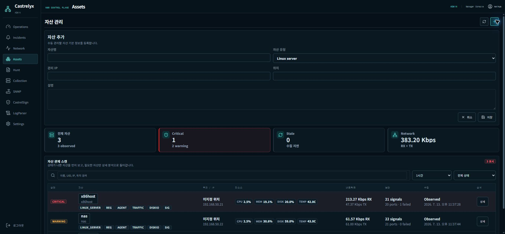

`자산 추가`에서 자산명, 유형, 관리 IP, 위치, 설명을 입력한다. 저장 전 같은 IP나 UID의 기존 자산이 없는지 검색한다. 캡처 중에는 실제 자산을 생성하지 않았다.

### 7.10 자산 수정

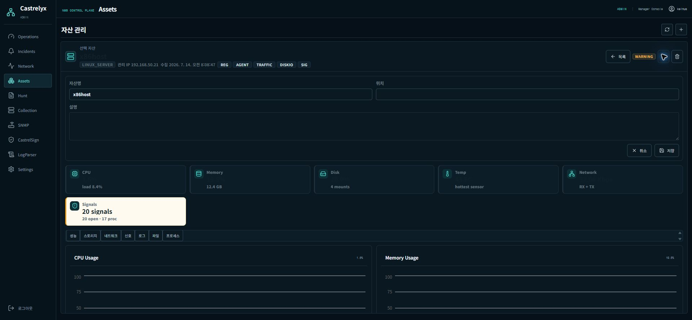

자산 상세 우측 상단의 수정 아이콘을 누르면 자산명, 위치, 설명을 변경할 수 있다. 수정 화면만 확인한 뒤 `취소`했으며 실제 데이터는 변경하지 않았다. `자산 삭제`는 복구가 필요한 운영 변경이므로 UID와 관리 IP를 재확인한 뒤 별도 절차로 수행한다.

## 8. Hunt

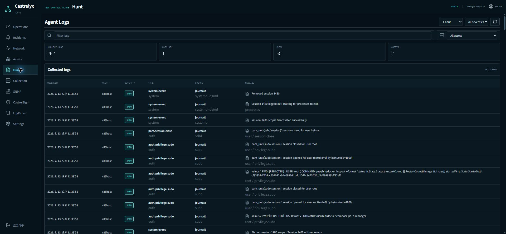

Hunt는 여러 Agent의 로그를 한 화면에서 검색한다.

1. `Log range`에서 조사 범위를 선택한다.
2. `Log severity`와 `Log asset`으로 대상을 좁힌다.
3. `Filter agent logs`에 메시지, 유형 또는 source 검색어를 입력한다.
4. Warning+와 Auth 카운트를 먼저 보고 관련 행을 시간순으로 확인한다.

로그 화면에는 내부 사용자명, 주소, 서비스 정보가 포함될 수 있으므로 외부 공유 전에 비식별화한다.

## 9. Collection

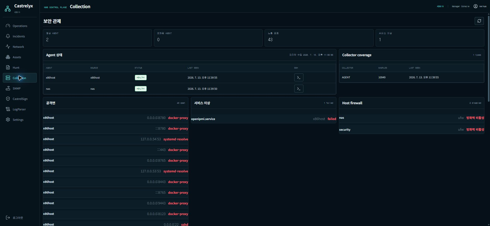

Collection은 Agent와 보안 수집 경로의 상태를 확인한다.

- 정상/오래된 Agent와 마지막 수집 시각
- Collector coverage와 샘플 수
- 열린 포트 기반 공격 표면
- 실패 서비스
- Host firewall 비활성 상태
- 최신 resource telemetry

`Agent 정보 새로고침` 후 마지막 수집 시각이 실제로 움직이는지 확인해야 한다.

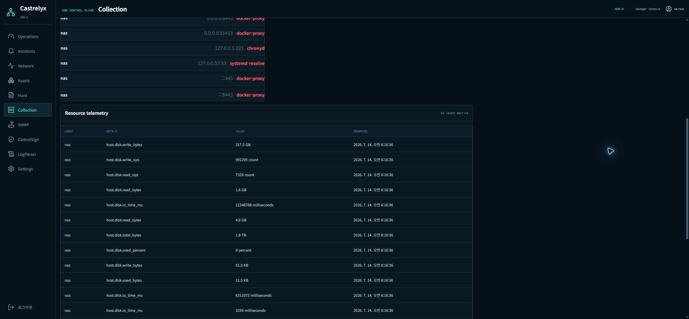

하단 `Resource telemetry`는 Agent, metric, value, observed 시각을 표시한다. 동일 metric이 여러 장치나 mount에서 반복될 수 있으므로 단일 행만 보고 장비 전체 상태를 판단하지 않는다.

### 9.1 WebSSH

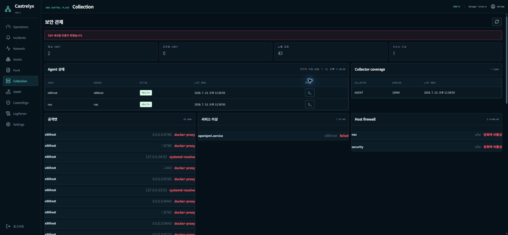

각 Agent 행의 SSH 버튼은 브라우저 터미널을 연다. 캡처 시점의 `x86host`에서는 `SSH 세션을 만들지 못했습니다.`가 표시됐다. Agent가 HEALTHY여도 원격 작업 경로가 정상이라는 뜻은 아니다. Manager 원격 접근 설정, Agent remote-task 지원, 인증 정보, Manager에서 Agent로 가는 연결을 별도로 점검한다.

## 10. SNMP

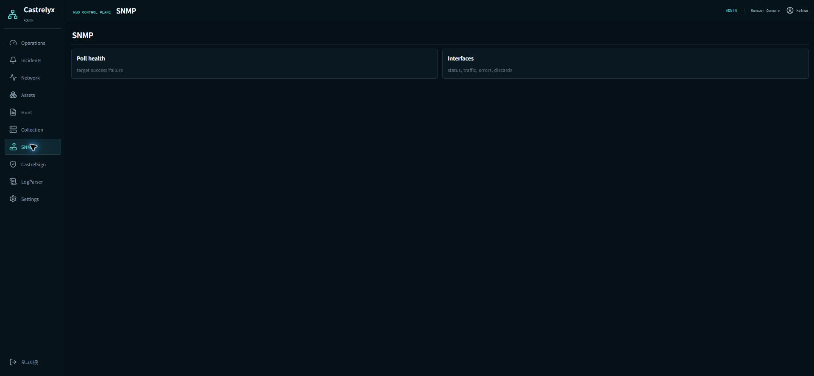

현재 화면에는 `Poll health`와 `Interfaces` 안내만 있고 실제 target 또는 interface 데이터는 없다. 대상과 polling을 구성한 뒤 성공/실패 수, 상태, 트래픽, errors, discard를 확인한다.

## 11. CastrelSign

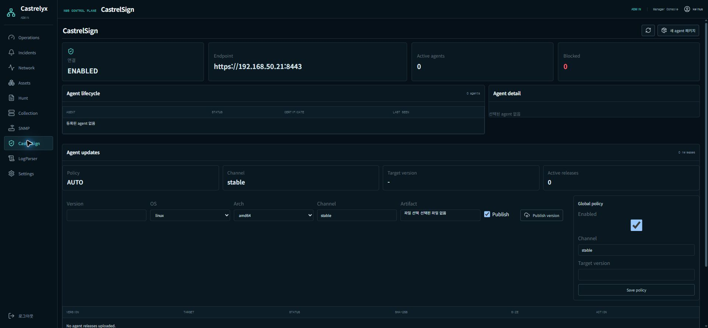

CastrelSign은 Agent lifecycle, enrollment token, 인증서, Agent release, 전역 업데이트 정책과 감사 이력을 관리한다. 캡처 당시 endpoint는 `https://192.168.50.21:8443`이고 등록 Agent와 release는 0개였다.

### 11.1 새 Agent 패키지

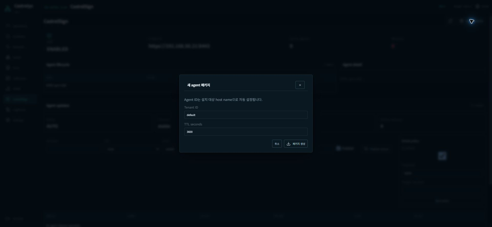

`새 agent 패키지`에서 Tenant ID와 TTL을 지정한다. Agent ID를 생략하면 대상 hostname으로 자동 설정된다. `패키지 생성`은 일회성 enrollment package와 token을 실제로 만들고 다운로드를 시작하므로 설치 대상과 TTL이 확정된 경우에만 실행한다. 캡처 중에는 패키지를 생성하지 않았다.

### 11.2 Release와 전역 정책

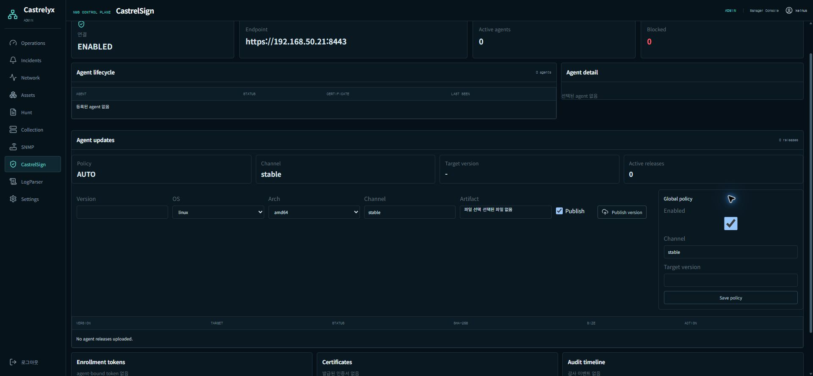

Agent release 업로드 시 Version, OS, Arch, Channel, Artifact, Publish를 확인한다. `Save policy`, release publish, token 폐기, Agent 차단/재활성화는 실제 운영 상태를 변경한다.

### 11.3 Token, 인증서, 감사와 업데이트 이력

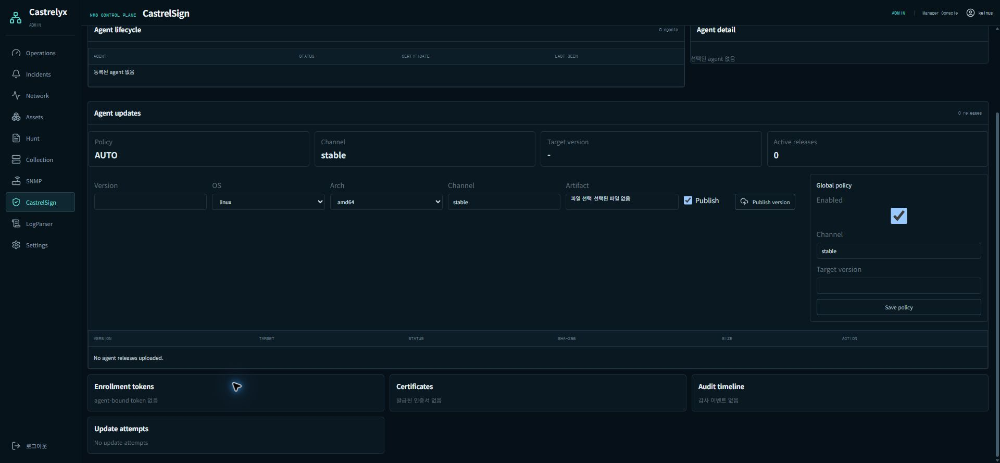

`Enrollment tokens`, `Certificates`, `Audit timeline`, `Update attempts`에서 발급·폐기·배포 이력을 확인한다. 캡처 당시 각 목록은 비어 있었다.

## 12. LogParser

Manager의 `LogParser`는 새 탭에서 `http://192.168.50.21:8765/`를 연다. 새 UI는 정상 렌더링되며 버전은 `v0.2.3-stable`이다.

### 12.1 Overview와 Actions

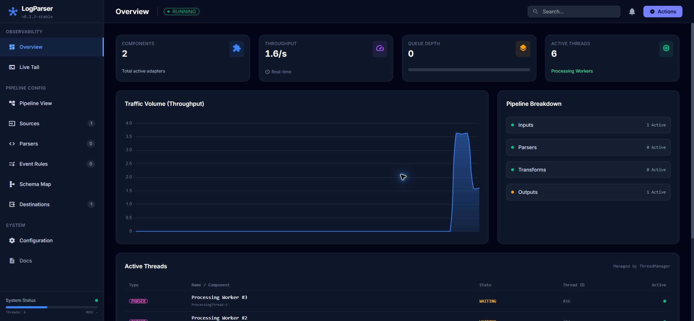

Overview에서 RUNNING 상태, 활성 component, 실시간 throughput, queue depth, worker thread와 pipeline breakdown을 확인한다. 캡처 시 파이프라인은 1개 input과 1개 활성 output을 사용하고 queue depth는 0이었다.

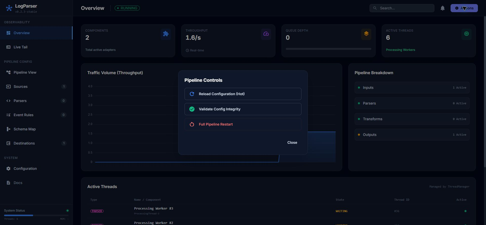

`Actions`에는 다음 제어가 있다.

- `Reload Configuration (Hot)`
- `Validate Config Integrity`
- `Full Pipeline Restart`

모두 실행 상태에 영향을 줄 수 있으므로 변경 승인과 점검 창을 확인한 뒤 사용한다. 캡처 중에는 실행하지 않았다.

### 12.2 Live Tail

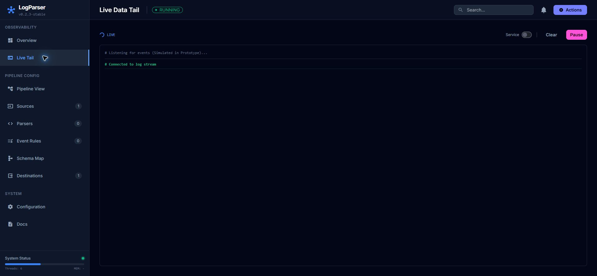

실시간 이벤트를 필터링하고 Pause 또는 Clear할 수 있다. 장시간 열어 둘 때는 브라우저 자원 사용과 표시 지연을 함께 확인한다.

### 12.3 Pipeline View

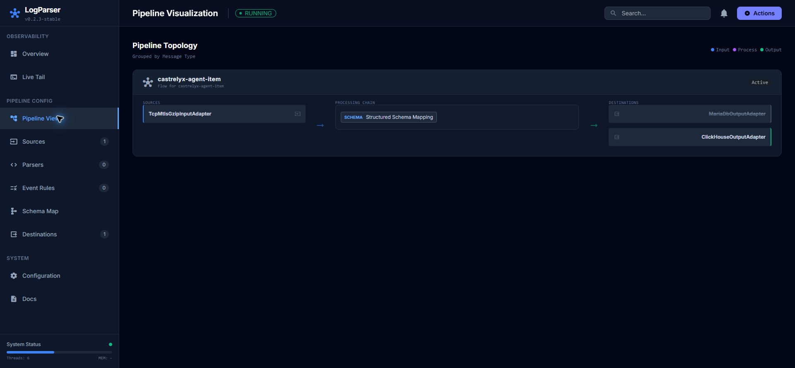

Input, processing chain, schema, destinations의 연결을 message type별로 확인한다. `castrelyx-agent-item`은 `TcpMtlsGzipInputAdapter`에서 들어와 schema mapping을 거쳐 output으로 전달된다.

### 12.4 Sources

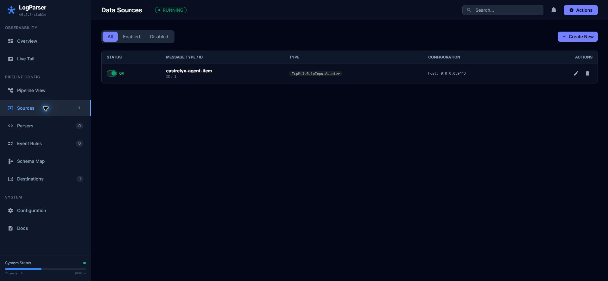

Sources에서 adapter 상태, message type, listen 주소, 편집·삭제를 확인한다. 실제 입력은 `0.0.0.0:9443`의 `TcpMtlsGzipInputAdapter`다.

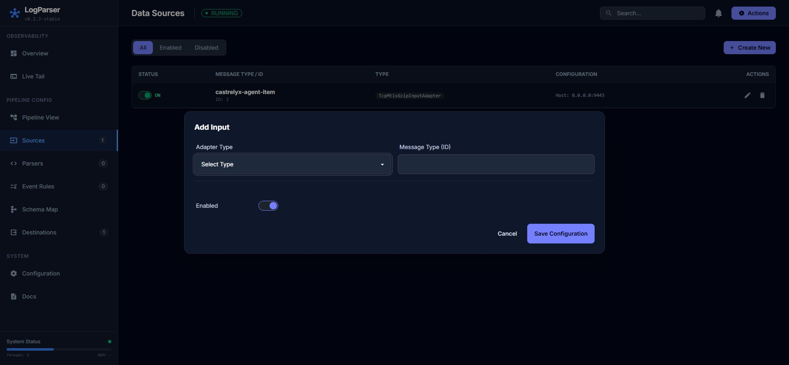

`Create New`는 TCP, TLS, UDP, HTTP(S), Kafka, SNMP, RabbitMQ, Castrelyx mTLS gzip, File, Fake input을 선택할 수 있다. 대화상자만 열었으며 저장하지 않았다.

### 12.5 Parsers와 Regex 테스트

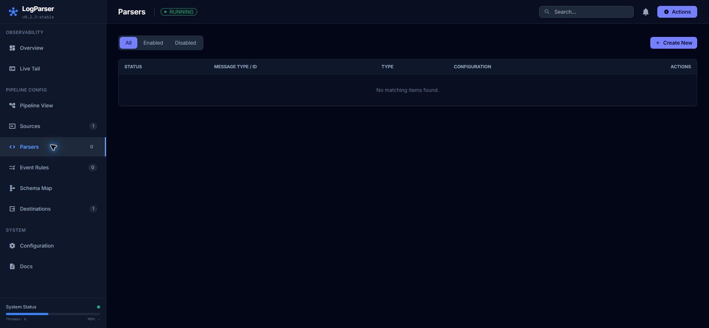

Parser 목록에서 활성 여부, message type, type과 설정을 관리한다.

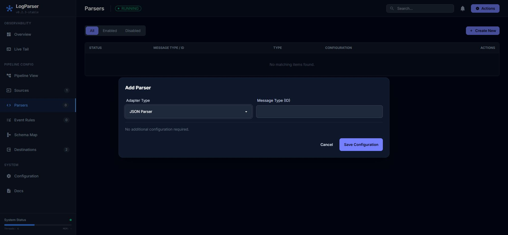

지원 선택지는 JSON, Grok, Regex, RFC3164, RFC5424, HTTP parser다.

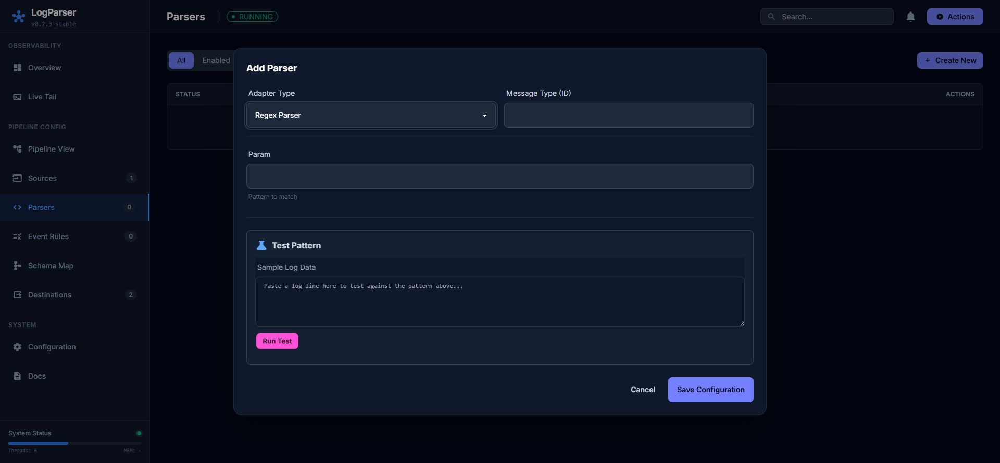

Regex Parser를 선택하면 pattern과 sample log를 입력하고 `Run Test`로 저장 전에 일치 결과를 확인할 수 있다. 테스트 화면만 확인했고 값을 저장하지 않았다.

### 12.6 Event Rules

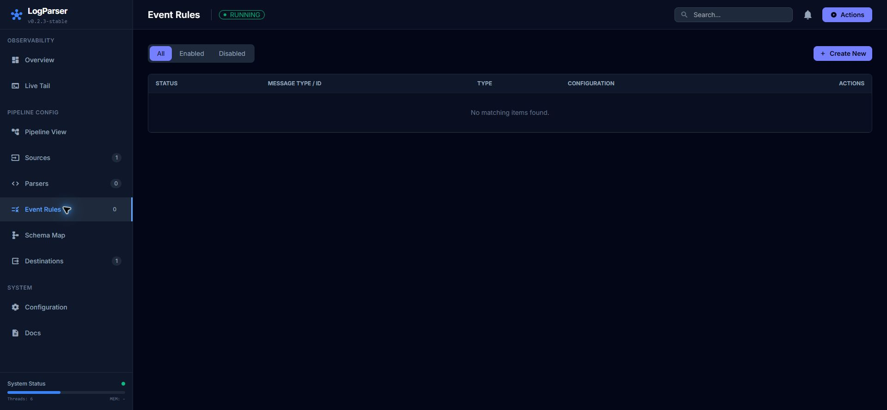

Event Rules는 메시지 변환 규칙을 관리한다.

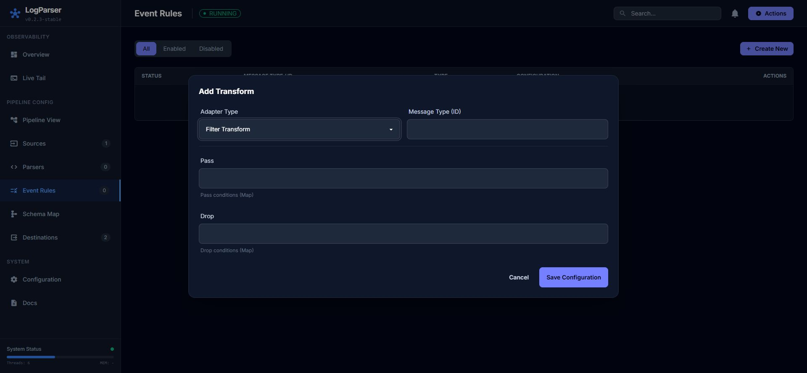

생성 대화상자의 실제 제목은 `Add Transform`이며 Filter, Add Property, Remove Property를 선택할 수 있다. 캡처 중에는 규칙을 만들지 않았다.

### 12.7 Schema Map

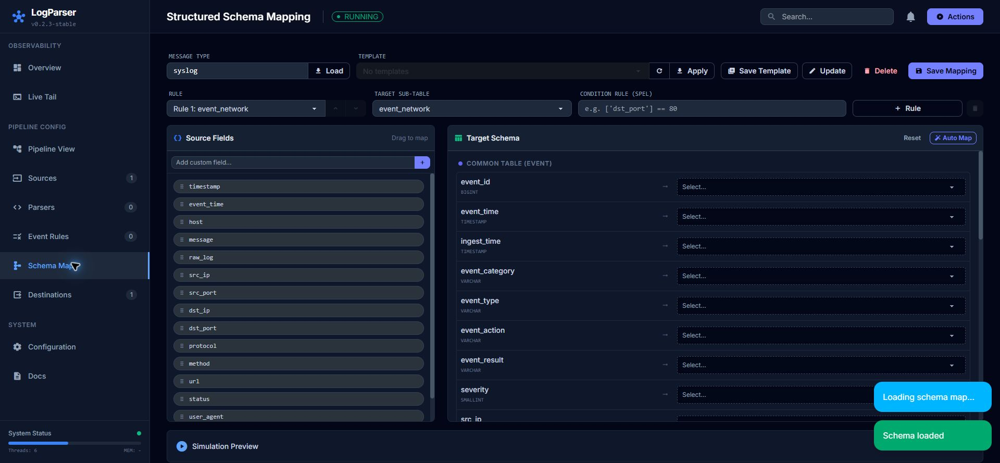

Structured Schema Mapping에서 source field와 target field를 연결하고 타입·기본값을 관리한다. `Import Schema`, `Export Schema`, 저장 계열 버튼은 실제 매핑을 바꾸므로 적용 전 기존 schema를 백업한다.

### 12.8 Destinations

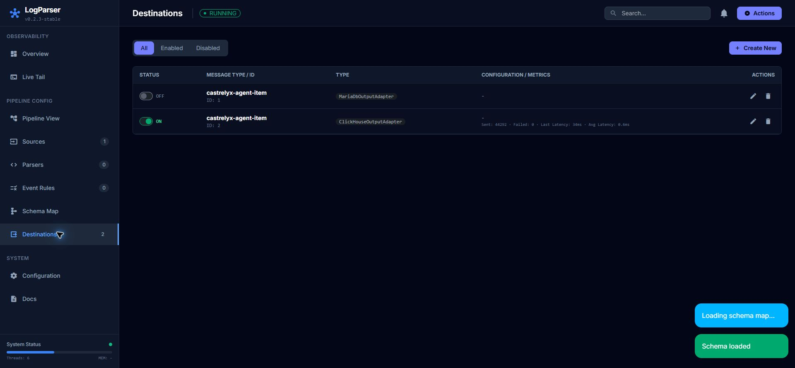

정의된 output은 MariaDB와 ClickHouse 두 개이며, 캡처 시 MariaDB는 비활성이고 ClickHouse는 활성이라 Overview의 활성 output 수는 1로 표시됐다. Sent, Failed, latency를 함께 확인한다.

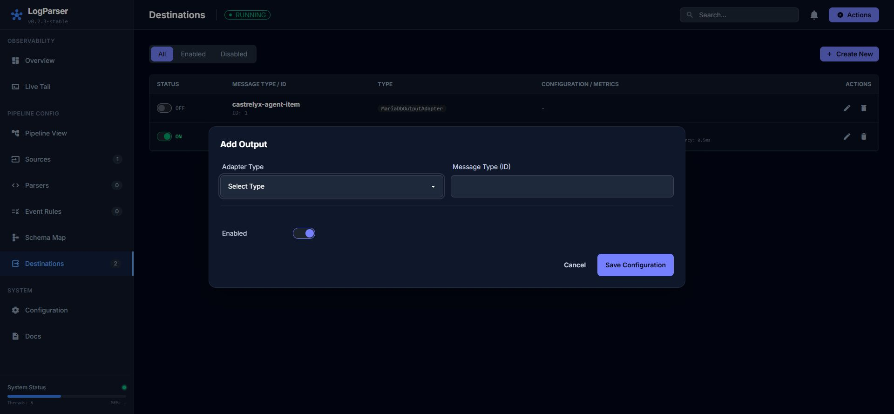

`Create New`는 Console, TCP, HTTP, Kafka, OpenSearch, RabbitMQ, MariaDB, ClickHouse, Benchmark output을 선택할 수 있다. 대화상자만 열고 저장하지 않았다.

### 12.9 Configuration

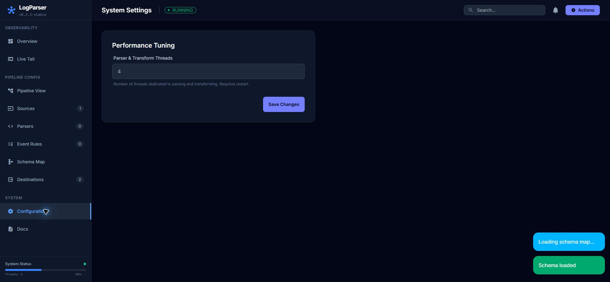

`Performance Tuning`의 parser/transform thread 수는 재시작이 필요한 설정이다. 변경 전에 현재 처리량, queue, CPU, 지연을 기록하고 적용 후 같은 지표를 비교한다.

### 12.10 Docs

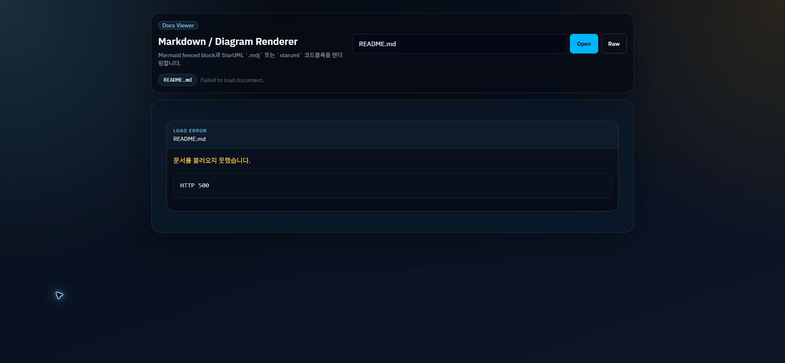

Docs Viewer 자체는 열리지만 `README.md` 로딩은 `HTTP 500`으로 실패했다. UI가 정상이라는 사실과 문서 API가 정상이라는 사실을 분리해 판단해야 한다.

## 13. Settings

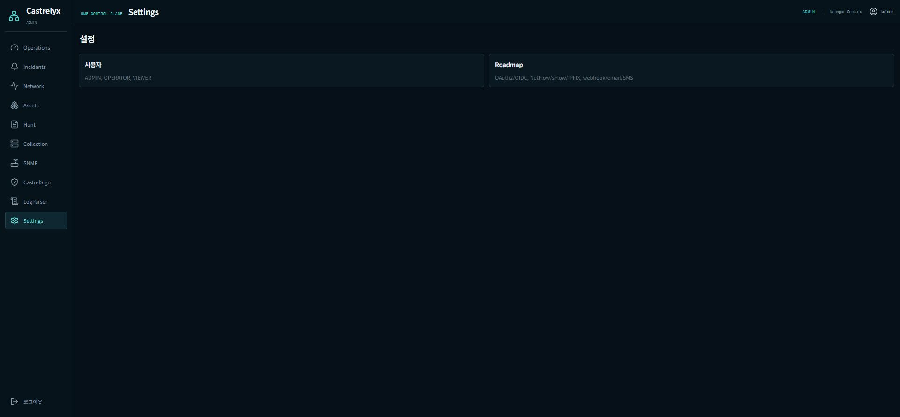

현재 Settings는 역할(`ADMIN`, `OPERATOR`, `VIEWER`)과 향후 OAuth2/OIDC, NetFlow/sFlow/IPFIX, webhook/email/SMS 계획을 안내한다. 화면에서 직접 저장하는 설정 항목은 없다.

## 14. 서버 21 실상태 검증

2026-07-13 23:47 KST에 화면 캡처와 별도로 읽기 전용 점검을 수행했다.

| 확인 항목 | 결과 |
|---|---|
| SSH 22 | 접속 가능 |
| `castrelyx-agent` | `active`, `NRestarts=0` |
| Docker / containerd | `active` |
| Manager | HTTPS `200`, title `Castrelyx Manager` |
| LogParser | HTTP `200`, title `LogParser - Data Pipeline Console` |
| LogParser pipeline API | `RUNNING`, input 1, active output 1, queue 0/10000 |
| Listener | `443`, `8443`, `8765`, `9443` 모두 LISTEN |
| 9443 TLS | handshake 성공, 인증서 `CN=192.168.50.21` |
| CastrelSign 8443 root | HTTP `404`; 서비스 자체는 응답 |

Docker socket은 `root:docker` mode `660`이고 현재 SSH 계정에는 접근 권한이 없었다. `docker ps`는 permission denied, `sudo -n docker ps`는 비밀번호 필요로 차단됐다. 따라서 컨테이너 목록은 확인하지 못했지만 서비스, 프로세스, 포트, HTTP, LogParser pipeline은 정상으로 검증됐다.

## 15. 일일 운영 점검 순서

1. Operations에서 수집 장비 수, 지연 장비, CPU·RAM·Disk I/O·Network I/O를 확인한다.
2. Incidents에서 Active와 Critical/Warning을 확인한다.
3. Collection에서 Agent 상태, collector sample, Resource telemetry의 최근 시각을 확인한다.
4. Network에서 RX/TX 급증과 임계값 초과를 확인한다.
5. Assets에서 WARNING, Stale, 미수집 자산을 열어 성능, 신호, 로그를 교차 확인한다.
6. 필요할 때 Hunt로 여러 Agent 로그를 시간순으로 조사한다.
7. LogParser에서 RUNNING, queue depth, input/output, failed count를 확인한다.
8. SNMP와 CastrelSign은 데이터 유무와 연결 상태를 각각 확인한다.

## 16. 캡처 시점의 확인된 제약

| 항목 | 실제 확인 결과 | 운영 판단 |
|---|---|---|
| 자산 파일 관리자 | `503 upstream service unavailable` | 현재 파일 작업 불가 |
| WebSSH | `SSH 세션을 만들지 못했습니다.` | Agent HEALTHY와 별개로 원격 접근 경로 점검 필요 |
| LogParser Docs | `README.md` 요청 `HTTP 500` | 문서 API 또는 문서 경로 점검 필요 |
| SNMP | 실제 target/interface 데이터 없음 | 대상 등록과 polling 구성 확인 필요 |
| CastrelSign | 등록 Agent/release 0 | enrollment와 release 배포 전 상태 |
| Docker 상세 | socket permission denied, passwordless sudo 불가 | 컨테이너 목록 확인에는 권한 필요 |

이 문서의 캡처에는 실제 내부 IP, 자산명, 프로세스, 포트와 로그 정보가 포함된다. 저장소 외부로 배포할 때는 보안 검토와 필요한 비식별화를 먼저 수행한다.
